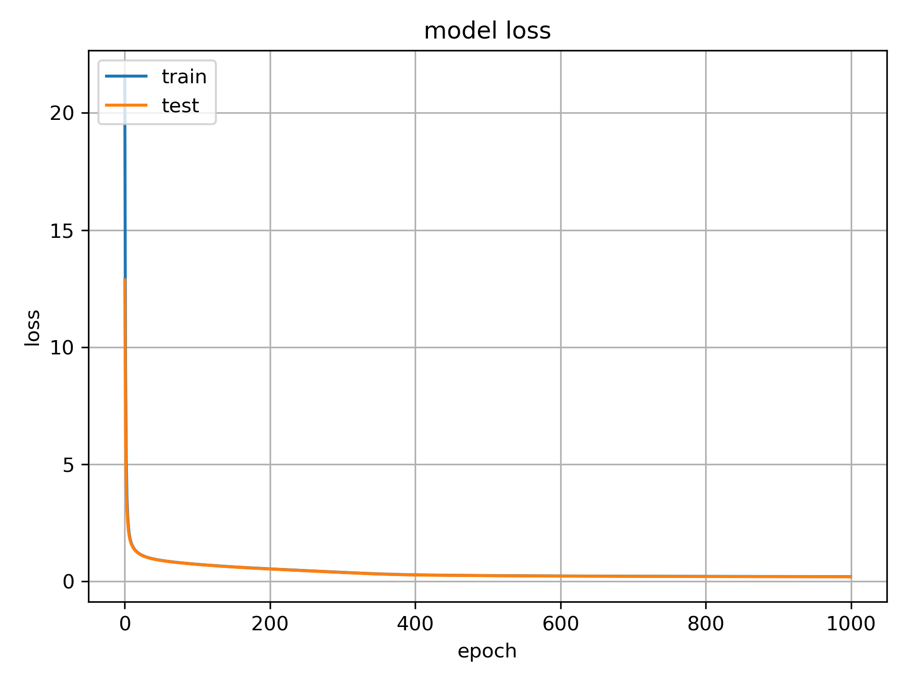

```{r include=FALSE}
knitr::opts_chunk$set(echo = TRUE)
knitr::opts_chunk$set(cache = TRUE)
knitr::opts_chunk$set(warning = FALSE)
knitr::opts_chunk$set(out.extra = '')
#knitr::opts_chunk$set(fig.pos = 'H')
```

\begin{centering}
\vspace{3 cm}

\Large

\normalsize
XX

\vspace{3 cm}
\end{centering}

\setcounter{tocdepth}{2}


```{r , fig.cap="test", fig.width=12, fig.height=3,  echo=FALSE}

# \tableofcontents

# \newpage


#plot(x,y)

```


```{r, include=FALSE}

# Load packages and settings
library(sqldf)
library(ggplot2)
library(knitr)
library(rmarkdown)
library(gplots)
library(RColorBrewer)
library(reshape2)
library(png)
library(grid)
library(gridExtra)
library(lme4)
library(lmerTest)
library(lubridate)
library(reshape2)
library(data.table)
library(pheatmap)
library(cba)
library(rstanarm)
library(shinystan)
library(rstantools) # make a rstanarm package
library(bayesplot)
library("factoextra") #install_github("kassambara/factoextra")
library(rpart)
library(partykit)
library(coin)
library(survival)
library(KMsurv)
library(survminer)
library(shiny)
library(precrec)
library(pROC)
library(PRROC)
library(Cairo)
library(tidyr)
library(readxl)
library(tinytex)

source("convert_aupr_to_ggplot.R")

REQUIRED_PACKAGES <- c(
  "car",  # may need: sudo apt install libgfortran3
  "data.table",
  "ggplot2",
  "lubridate",
  "RODBC",
  "shinystan"
  # "survival"
  # "timereg"
)

LIBRARY_PREFIX <- "https://egret.psychol.cam.ac.uk/rlib/"

#source(paste0(LIBRARY_PREFIX, "datetimefunc.R"))
source("datetimefunc.R")
source(paste0(LIBRARY_PREFIX, "dbfunc.R"))
source(paste0(LIBRARY_PREFIX, "listfunc.R"))
source(paste0(LIBRARY_PREFIX, "listassign.R"))
source(paste0(LIBRARY_PREFIX, "miscfile.R"))
source(paste0(LIBRARY_PREFIX, "misclang.R"))
source(paste0(LIBRARY_PREFIX, "miscstat.R"))
source(paste0(LIBRARY_PREFIX, "stanfunc.R"))
source(paste0(LIBRARY_PREFIX, "cris_common.R"))

misclang$library_or_install(REQUIRED_PACKAGES)

# As advised by Stan:
rstan::rstan_options(auto_write = TRUE)
options(mc.cores = parallel::detectCores())

# Other misc commands
BIGSEP   <- "===============================================================================\n"
SMALLSEP <- "-------------------------------------------------------------------------------\n"
SEP      <- "-------------------------------------------------------------------------------\n"

```


# Abstract

Mental health disorders affect many people in the UK. Clinical data routinely collected in hospitals can help in more effective treatment of these patients.

<!-- We outline machine learning and statistical approaches for generating insights, stratifying patients and predicting mortality from mental health data. -->

<!-- We have created a computational framework for integrating clinical data in mental health and interrogating it with machine learning techniques. This will help generate insights into mental health disorders, stratify patients and predict mortality. -->

<!-- We view our work as a first step towards data science in the clinic and personalized medicine for mental health. -->

We have implemented a computational framework for integrating clinical data in mental health and interrogating it with statistical learning techniques. This is an interpretable Artificial Intelligence (AI) system that generates insights into mental health disorders and helps stratify patients.

We utilized routinely collected clinical data from an observational study to answer questions of mortality in patients with SMI. We have built an interpretable machine learning and decision making system for applications to mental health. 
<!-- This is integrated with a knowledge repository of expertise in domain experts. The data frame of features and metafeatures is a frame in AI [@Schank1977]. It combines expert knowledge from domain experts about mental health, physical health and social factors. -->


Our framework captures clinical information on physical health, mental health and social predisposing factors to create a profile for a patient. This signature is used to stratify patients and predict mortality.
  
Computer methods such as machine learning can discover new patterns in clinical data, and generate new insights. Unfortunately many of these methods cannot explain why they made a particular prediction and explainability is very important in healthcare. Our methods make predictions explainable by using human understandable techniques inspired by social sciences research called class-contrastive reasoning [@Sokol2018].

An example of a class-contrastive explanation is:

"This patient is predicted to be in a severe category because age is greater than 90 and the patient has a serious disease. If the age was less than 60, then the prediction would have been different"

We find that second generation antipsychotics and anti-depressants like selective serotonin reuptake inhibitors are protective in a group of patients. This is supported by our class-contrastive analysis and classical survival analysis.
 
<!-- A lack of family involvement at first contact with mental health services has been reported to be confounded with illicit substance abuse and unnatural cause mortality [@Reininghaus2015].  -->
Our work also suggests suggests that involving family members and carers could be part of health management plans [@Power2003]. 


Our work also has the potential for patient stratification. 
<!-- These patients can be referred to crisis help centers.  -->
This may lead to new studies that try to validate these findings. We can also recommend interventions.
<!-- , like service level improvements, specialized smartphone apps [@Sahakian2015a] or meditation and mindfulness training [@Galante2018].  -->

<!-- We have also released our computational tools as open-source software. We hope this will help emerging economies and developing nations which are currently modernizing their electronic healthcare records systems. -->

We took a patient-centric participative design approach. We integrated outreach and patient public involvement in a user-centric participatory design loop. Our approach of collaborative user-centric participatory design with clinicians, patients and data scientists outlines how machine intelligence can be used in mental health. 
<!-- Participatory design can be used to collaborate and co-create with various stakeholders [@Orlowski2016] [@Davis2018].  -->
<!-- This can be used to create AI driven solutions for social good.  -->

Our integrated AI system combines domain knowledge and clinical data, and interrogates it with machine learning approaches. It makes predictions interpretable to domain experts by using class-contrastive reasoning. 
This is a step towards a conversational and interactive AI for serious mental illnesses. Our work is an example of personalized medicine for mental health.


# Author summary

People with serious mental illnesses such as schizophrenia and bipolar disorder die earlier than the average [@Olfson2015] [@Chang2010a]. It is difficult to predict who is at the greatest risk, and therefore who might benefit from interventions and treatments. Computer methods such as machine learning can discover new patterns in clinical data and generate new insights. 

Unfortunately many of these methods cannot explain why they made a particular prediction and explainability is very important in healthcare. Our methods make predictions explainable by using human understandable techniques inspired by social sciences research called class-contrastive reasoning [@Sokol2018].

An example of a class-contrastive explanation is:

"This patient is predicted to be in a severe category because age is greater than 90 and the patient has a serious disease. If the age was less than 60, then the prediction would have been different"

We use a collaborative approach where patients, clinicians and data scientists will work together. They decide what data will be used as inputs to these computer models and also understand why these programs made a particular prediction.

Our projects were patient led and initiated reflecting the benefit of including patients with lived experience of serious mental illnesses.

One outcome of this work is finding groups of patients who are similar to each other and some of whom may be in a severe category. This may lead to new studies that try to validate these findings.

Another outcome is a methodology of how explainable machine learning can be used by patients, clinicians and data scientists to better human health. Our approach is an example of how computer methods can be applied to mental health and potentially other diseases.


# Graphical abstract

A diagram to summarize our approach and findings is shown below. 

<!--  -->


# Introduction

Mental health disorders affect many people in the UK. Clinical data routinely collected in hospitals can help in more effective treatment of these patients.

Mortality among patients with serious mental illnesses (SMI) is high [@Olfson2015] [@Chang2010a].
Linking multimodal clinical datasets may help improve mortality amongst patients [@Cardinal2015].
Clinical datasets, appropriately anonymised using computational tools [@Cardinal2017], can be used by machine learning algorithms to predict mortality in patients or prioritize at-risk patients for follow-up.

<!-- We seek to answer the following question: what are the greatest risk factors for mortality in patients with SMI and how can wwe predict mortality in these patients? -->

Unfortunately, many machine learning methods have difficulty explaining why they made a particular prediction and explainability is very important in healthcare. Our methods make predictions explainable by using human understandable techniques inspired by social sciences research called class-contrastive reasoning [@Sokol2018] [@Miller2019].


<!-- Our computational framework integrates routinely collected mental health clinical data with statistical learning techniques. This is used to generate insights into mental health disorders and help stratify patients. -->


Our framework integrates data on clinically relevant bio-social factors that are risk factors in serious mental illnesses. The features we use span physical health, mental health, personal history and social predisposing factors.
<!-- imposes a custom domain ontology and knowledge representation scheme.  -->
The features include age, high-level diagnosis categories and high-level medication categories. We also include bio-social factors that are important in SMI like information on mental health, personal history like prior suicide attempt and substance abuse, and social predisposing factors like lack of family support. These features are used as input to our statistical and machine learning algorithms and are used to stratify patients and predict mortality.

  
<!-- Our integrated Artificial Intelligence (AI) system combines domain knowledge and clinical data, and interrogates it with modern deep learning approaches. It makes predictions interpretable to domain experts by using class-contrastive reasoning. This is a step towards a conversational and interactive AI. -->

Our computational framework combines domain knowledge from clinicians and clinical data, and interrogates it with mchine learning approaches. Our class-contrastive reasoning technique then allows clinicians, data scientists and patients to understand the predictions.
 
<!-- Our work has potential for patient stratification. For these patients we can recommend interventions, like referrals to crisis centers, service level improvements or specialized smartphone apps [@Sahakian2015a] or meditation and mindfulness training [@Galante2018].  -->

<!-- We have also released our computational tools as open-source software. We hope this will help emerging economies and developing nations which are currently modernizing their electronic healthcare records systems. -->

<!-- We took a patient-centric participative design approach. We integrated outreach and patient public involvement in a user-centric participatory design loop. -->

<!-- Our approach of collaborative user-centric participatory design with clinicians, patients and data scientists outlines how machine intelligence can be used for social good.  -->
<!-- Participatory design can be used to collaborate and co-create with various stakeholders [@Orlowski2016] [@Davis2018].  -->
<!--  This can be used to create AI driven solutions for social good.  -->


<!-- It makes predictions interpretable to domain experts by using class-contrastive reasoning. This is a step towards a conversational and interactive AI. -->


Our work is an example of personalised medicine in mental health.


  
<!-- ## Analysis Plan -->

<!-- * Before proceeding with statistical analysis, we will conduct exploratory surveys of the dataset to assess the number of subjects prescribed medications, the number of observations per subject, and the degree of missingness of data relevant to the analyses. -->

<!-- * We will report proportions of patients prescribed different medications. -->

<!-- * The association between different medications prescribed and mortality will be explored. We will adjust for other factors like age, sex, co-prescription and co-morbidity status.  -->


# Data and Methods

## Mental health clinical record database

We use data from an electronic patient record system for mental health at Cambridge University Hospital. The patient data has been anonymised using \textit{CRATE} [@Cardinal2017]. The clinical records system includes data on patient demographics, medications and co-morbidities. The date of death of an individual is derived from the National Heath Service (NHS) spine. We included all patients in the Cambridgeshire and Peterborough NHS Foundation Trust (CPFT) referred to secondary care.

## Medicine database

We extracted medicine information by using natural language processing (NLP) on clinical freetext data using the \textit{GATE} software [@Cunningham2013]. 

## Population mortality data

Population mortality data was used from the Office for National Statistics (ONS) [@ONS_death_data_table].


## Data pre-processing

Diagnosis codes are based on the International Classification of Diseases (ICD-10) coding system [@icd10_who]. As others before [@Chang2011], we define serious mental illnesses (SMI) as schizophrenia (F20), schizoaffective disorder (F25),  bipolar disorder (F31), and substance use disorders (F10 to F19). Five-year age groups were defined (0-4, 5-9, ..., 85-90, and greater than 90 years). Population mortality data was downloaded from the Office for National Statistics (ONS) [@ONS_death_data_table].


## Data input to statistical algorithms

The features that are input to our statistical and machine learning algorithms include age, gender, high-level diagnosis categories and high-level medication categories. These include a range of bio-social factors that are important in SMI. The date of death of an individual is derived from the NHS spine. All the features are listed below.

* The high level medication categories were created based on expert knowledge input from clinicians. These include medication categories like second generation antipsychotics (SGA: clozapine, olanzapine, risperidone, quetiapine and aripiprazole), first generation antipsychotics (FGA: haloperidol), anti-depressants like selective serotonin reuptake inhibitor (SSRI: sertraline, citalopram, escitalopram, fluoxetine, fluvoxamine, paroxetine, vortioxetine and venlafaxine), diuretics (furosemide), thyroid (drug mention of levothyroxine), antimanic drugs (lithium) and medications for dementia (memantine and donepezil).

* Relevant co-morbidities that we included are diabetes (inferred from ICD-10 codes E10, E11, E12, E13 and E14 and any mentions of drugs like metformin and insulin), cardiovascular diseases (inferred from ICD-10 diagnoses codes I10, I11, I26, I82, G45 and drug mentions of atorvastatin, simvastatin and apirin), respiratory illnesses (J44 and J45) and anti-hypertensives (mentions of drugs like bisoprolol and amlodipine).

* The broad level diagnosis categories we included are dementia in Alzheimer's disease (ICD-10 chapter code F00), delirium (F05), mild cognitive disorder (F06), schizophrenia (F20), bipolar disorder (F31), major depression (F32, F33) and emotional personality disorder (F60). 

* We also included relevant social factors like lack of family support (ICD-10 chapter code Z63) and personal risk factors like alcohol and substance abuse (this was inferred from coded diagnosis at ICD-10 chapter level codes of Z86, F10, F12, F17, F19 and references to thiamine which is prescribed for alcohol abuse). Other features included are self harm (ICD-10 codes T39, T50, X60, X61, X62, X63, X64, X78 and Z91.5), non-compliance and personal risk factors (Z91.1), referral to a crisis team at Cambridge University Hospitals and any prior suicide attempt (in the last 6 months or any time in the past). 

These broad categories or metafeatures constitute our domain expert based knowledge representation. These data structures capture different information about the patient related to mental health, physical health, social factors and predisposing factors.

<!-- can also be interpreted as frames (encapsulating domain knowledge) [@Schank1977] and are used in our computational framework to perform frame-based reasoning and build interpretable models. -->


## Machine learning and statistical techniques

We performed logistic regression using generalized linear models [@Cardinal2013] [@Winter2013] [@Bates2015]. The numeric features are age (normalized and scaled). There are a large number of categorical features (like medications, comorbidities and other social and personal predisposing factors) which are encoded using a one-hot representation.

<!-- We also performed linear mixed effects regression in a Bayesian setting using probabilistic programming frameworks [@Salvatier2015][@Tran2016][@Carpenter2017]. -->
  
We also use an artificial neural network called an autoencoder to integrate data from different sources giving a holistic picture of mental health, physical health and social factors contributing to mortality in SMI. Similar approaches have been used in the field of cancer modelling to integrate data from different sources [@Simidjievski2019b]. We use the \textit{keras} package [@keras_software] with the \textit{Tensorflow} backend [@Abadi2016]. 

The autoencoder performs dimensionality reduction. The reduced dimensions of the autoencoder are used to predict mortality (supervised task) and also used for patient stratification (unsupervised).

<!-- Regression trees, decision trees, and trees for classification were created using the R packages \textit{rpart} and \textit{partyfit} [@Hothorn2006]. Decision trees can be used for interpretability in healthcare [@Muller2019]. -->


<!-- We performed a 75-25 training-test split of the data. -->

<!-- We added an $L_{1}$ penalty term for the weights to perform regularization and a categorical cross-entropy loss function. Our dataset has more negative examples (patients who are alive) than positive (deceased patients). To compensate for over-penalizing negative examples, we bias the weight for positive samples in the cost function as performed in [@Liberis2018]. -->


To predict mortality we use a 

* logistic regression model with all the original input features 

* reduced dimensions from an autoencoder which are then used as input to a random forest model 

* reduced dimensions from an autoencoder which are then used as input to an automated machine learning framework using the \textit{TPOT} package [@Olson2016].


<!-- To predict mortality we use a feedforward neural network with a dense hidden layer of 10 neurons. -->
<!-- Other methods to initialize RNNs \cite{Le2015} -->


<!-- We used a sigmoid activation function for the final output layer. -->

We also perform unsupervised patient stratification using the reduced dimensions of the autoencoder.


## Software

All software was written in the R [@R_software] and Python programming languages. Visualizations were performed using the \textit{shiny} and \textit{ggplot} packages in R [@R_shiny],[@Ross2017],[@Wickham2009]. Linear mixed effects and generalized linear model (GLM) regression was performed using the \textit{lmerTest::lmer()} and \textit{glm} functions in R [@Kuznetsova2017] [@Bates2015].

Hierarchical clustering and visualization was performed using heatmaps in the \textit{pheatmap} package [@software_pheatmap]. Hierarchical clustering was optimized by leaf node reordering using the \textit{cba} package [@cba_package_R]. Survival analysis was conducted using the \textit{survminer} package in R [@Kassambara2019].

<!-- All code is available online in a package with manuals and vignettes -->

<!-- (https://egret.psychol.cam.ac.uk/git/cpft_analyses/mortality_calculations). -->


```{r, echo=FALSE}

# =============================================================================
# Directories
# =============================================================================

#THIS_SCRIPT_DIR <- miscfile$current_script_directory()
THIS_SCRIPT_DIR <- "Z:/cam_project/code/cpft_mortality" # "C:/Users/sbanerjee/Downloads"
SOURCE_DATA_DIR <- file.path(THIS_SCRIPT_DIR, "source_data")
FIT_CACHE_DIR   <- file.path(THIS_SCRIPT_DIR, "fitcache")


# =============================================================================
# Basic analysis
# =============================================================================

getTemperatureData <- function(
  filename = file.path(SOURCE_DATA_DIR, "cetdl1772on.dat"),
  url = "https://www.metoffice.gov.uk/hadobs/hadcet/cetdl1772on.dat")
{
        if (!file.exists(filename)) {
          directory <- dirname(filename)
          if (!dir.exists(directory)) {
            stop("No such directory: ", directory)
          }
          download.file(url, filename)
        }
        rawdata <- fread(filename)
        months <- c("Jan", "Feb", "Mar", "Apr", "May", "Jun",
                    "Jul", "Aug", "Sep", "Oct", "Nov", "Dec")
        colnames(rawdata) <- c("year", "day", months)
        day_temperatures <- melt(
          data = rawdata,
          id.vars = c("year", "day"),
          measure.vars = months,
          variable.name = "month_name",
          value.name = "temperature_tenth_celsius"
        )
        day_temperatures[, month := match(month_name, months)]
        day_temperatures[, date := ISOdate(year, month, day)]
        # We will have silly dates like 31 Feb, so:
        day_temperatures <- day_temperatures[!is.na(date)]
        setkey(day_temperatures, date)
        day_temperatures[temperature_tenth_celsius == -999, temperature_tenth_celsius := NA]
        day_temperatures[, temperature_celsius := temperature_tenth_celsius / 10]
        # We might not have data to the end of the current year:
        last_rownum <- last(which(!is.na(day_temperatures$temperature_celsius)))
        day_temperatures <- day_temperatures[1:last_rownum]
        # day_temperatures[is.na(temperature_celsius)]
        day_temperatures[]  # fix display bug
        return(day_temperatures)
}


getTemperatureSummaries <- function(start_year = NULL,
                                    start_month = NULL,
                                    end_year = NULL,
                                    end_month = NULL)
{
        day_temperatures <- getTemperatureData()
        if (!is.null(start_year)) {
          day_temperatures <- day_temperatures[year >= start_year]
          if (!is.null(start_month)) {
            day_temperatures <- day_temperatures[year > start_year |
                                                   month >= start_month]
          }
        }
        if (!is.null(end_year)) {
          day_temperatures <- day_temperatures[year <= end_year]
          if (!is.null(end_month)) {
            day_temperatures <- day_temperatures[year < end_year |
                                                   month <= end_month]
          }
        }
        year_temperatures <- day_temperatures[
          ,
          .(mean_temp_c = mean(temperature_celsius, na.rm = TRUE)),
          by = .(year)
          ]
        year_month_temperatures <- day_temperatures[
          ,
          .(mean_temp_c = mean(temperature_celsius, na.rm = TRUE)),
          by = .(year, month, month_name)
          ]
        month_temperatures <- day_temperatures[
          ,
          .(mean_temp_c = mean(temperature_celsius, na.rm = TRUE)),
          by = .(month, month_name)
          # Potentially a bit iffy in terms of unweighted means,
          # i.e. leap years versus not; but will be tiny!
          ]
        return(list(
          day_temperatures = day_temperatures,
          year_temperatures = year_temperatures,
          month_temperatures = month_temperatures,
          year_month_temperatures = year_month_temperatures
        ))
}


interestingTemperaturePlots <- function()
{
      list[day_temperatures,
           year_temperatures,
           month_temperatures,
           year_month_temperatures] <- getTemperatureSummaries()
      # Climate change...
      p1 <- (
        ggplot(year_temperatures, aes(x = year, y = mean_temp_c))
        + geom_line()
      )
      # Seasonal variation
      p2 <- (
        ggplot(month_temperatures, aes(x = month, y = mean_temp_c))
        + geom_line()
        + scale_x_continuous(
          name = "Month",
          breaks = month_temperatures$month,
          labels = month_temperatures$month_name
        )
      )
      return(list(p1, p2))
}


fetchQuery <- function(sql, base_filename, dbhandle)
{
      filename <- file.path(SOURCE_DATA_DIR, paste(base_filename, ".rds", sep=""))
      dbfunc$getCachedQuery(filename, dbhandle, sql)
}


fetchTable <- function(table_spec, base_filename, dbhandle)
{
      sql <- paste("SELECT * FROM", table_spec)
      return(fetchQuery(sql, base_filename, dbhandle))
}


fetchCpftMortality <- function()
{
      dbhandle <- dbfunc$connectCpft()
      demographics <- fetchQuery(
        "
        SELECT
        Date_Of_Birth, Date_Of_Death, Death_Flag, Died_In_Hospital,
        Ethnicity_Code, Ethnicity_Description, Ethnicity_National_Code,
        Gender_Code,
        mrid, rid, crate_pk
        FROM RiO.dbo.Client_Demographic_Details
        ", "rio_client_demographic_details", dbhandle)
      diagnosis <- fetchQuery(
        "
        SELECT
        Diagnosis, Diagnosis_Code, Diagnosis_Start_Date, Diagnosis_End_Date,
        Entry_Date, Removal_Date,
        rid, crate_pk
        FROM RiO.dbo.Diagnosis
        ", "rio_diagnosis", dbhandle)
      return(list(
        demographics = demographics,
        diagnosis = diagnosis
      ))
}

```


```{r, echo=FALSE}

###############################################
# read data saved using data_saver.rmd
###############################################
df_combined_all_features <- readRDS(file = "source_data/df_combined_all_features.rds")

# to read daat saved using data_saver.rmd
df_med_suicide_features_lengthened_final <- readRDS(file = "source_data/df_med_suicide_features_lengthened_final.rds")

# load feature to metafeature mapping
df_feature_to_metafeature_map <- read.csv('feature_to_metafeature_mapping.tsv', 
                                        sep = '\t', header = TRUE, 
                                        stringsAsFactors=FALSE, na.strings="..") # ,strip.white = TRUE)
# TODO: Replacements for feature reorganisations
idx_to_replace_temp <- which(df_feature_to_metafeature_map$metafeature == 'dementia')
df_feature_to_metafeature_map[idx_to_replace_temp,]$metafeature <- "delirium"
idx_to_replace_temp <- which(df_feature_to_metafeature_map$metafeature == 'bipolar_drug')
df_feature_to_metafeature_map[idx_to_replace_temp,]$metafeature <- "antimanic_drug"
idx_to_replace_temp <- which(df_feature_to_metafeature_map$metafeature == 'blood_pressure')
df_feature_to_metafeature_map[idx_to_replace_temp,]$metafeature <- "anti_hypertensive"
idx_to_replace_temp <- which(df_feature_to_metafeature_map$metafeature == 'SSRI')
df_feature_to_metafeature_map[idx_to_replace_temp,]$metafeature <- "anti_depressant"

# output of df_all from data_saver.rmd
df_all <- read.csv('df_drug_diagnosis_age_gender_deep_format.tsv', 
                                        sep = '\t', header = TRUE, 
                                        stringsAsFactors=FALSE, na.strings="..") # ,strip.white = TRUE)

#dbhandle <- dbfunc$connectCpft()
#list[demographics, diagnosis] <- fetchCpftMortality()

# read diagnosis that is already modified in data_saver.rmd
diagnosis               <- readRDS(file = "source_data/diagnosis.rds")
demographics            <- readRDS(file = "source_data/demographics.rds")
df_patient_registration <- readRDS(file = "source_data/df_patient_registration.rds")


df_med_suicide_features_lengthened_final_f20 <- read.csv('source_data/df_med_suicide_features_lengthened_final_f20.csv', 
                                                          sep = ',', header = TRUE, 
                                                          stringsAsFactors=FALSE, na.strings="..") # ,strip.white = TRUE)

df_med_suicide_features_lengthened_final_ml_f20 <- read.csv('source_data/df_med_suicide_features_lengthened_final_ml_f20.csv', 
                                                          sep = ',', header = TRUE, 
                                                          stringsAsFactors=FALSE, na.strings="..") # ,strip.white = TRUE)

# TODO: renaming columns as part of feature reorganization
i_col_to_change_temp = grep("dementia", colnames(df_med_suicide_features_lengthened_final))
colnames(df_med_suicide_features_lengthened_final)[i_col_to_change_temp[1]] <- "delirium"
i_col_to_change_temp = grep("bipolar_drug", colnames(df_med_suicide_features_lengthened_final))
colnames(df_med_suicide_features_lengthened_final)[i_col_to_change_temp] <- "antimanic_drug"
i_col_to_change_temp = grep("blood_pressure", colnames(df_med_suicide_features_lengthened_final))
colnames(df_med_suicide_features_lengthened_final)[i_col_to_change_temp] <- "anti_hypertensive"
i_col_to_change_temp = grep("SSRI", colnames(df_med_suicide_features_lengthened_final))
colnames(df_med_suicide_features_lengthened_final)[i_col_to_change_temp] <- "anti_depressant"


```


# Results


<!-- ## Data exploration and quality control -->

<!-- We performed data exploration and visualization for the clinical data. -->
<!-- We joined patient demographics data with their medicine usage (derived from NLP analysis).  -->

<!-- We show the usage of different medications and other bio-social factors in all patients. -->

<!-- , how mortality varies with gender and distribution of age of death. -->


```{r, echo=FALSE}

# load data

# visualiuzae data
# 
# test and visualize distributons again in new rmd  analysis_mortality_cpft_metafeatures.rmd
# 
#          shiny humani computer interface and GUI like perclides neuro
#          
#          association mining with hypothesis  for schizophrenia using decision tree
#          
#          shiny GUI to explore data on schizophrenia
#               logistic rehression
#               time to event
#               SMR
#              stratify by age (those who are dying early) what features do they have, prior suicide, lack of family
#              association mining in GUI
#              GUI for clinical decision making     
#              
#          data frame iof features and metafeatures is frame
# 
# 
# age distribution
# 
# top comorbidities
# 
# top medications


```


```{r, include=FALSE, fig.cap="Usage of different medications (broad medicine categories) and other bio-social factors in CPFT clinical data."}


theme_set(theme_gray())
gp2 <- ggplot(df_all, aes(x=drug))#,fill=Gender_Code))
gp2 <- gp2 + geom_histogram(stat = "count")#(alpha=0.5)
# gp2 <- gp2 + xlab("Drug type") + ylab("Count") + title("Breakdown of data by type and name")
gp2 <- gp2 + theme(axis.text.x=element_text(angle = -90, hjust = 0))
gp2 <- gp2 + xlab("General category") 
gp2 <- gp2 + ylab("Count") 
# gp2 <- gp2 + title("Breakdown of data by type and name")
# gp2 <- gp2 + facet_wrap(drug_type~.)
#gp2 <- gp2 + facet_grid(drug~.)
gp2


theme_set(theme_gray())
gp2 <- ggplot(df_all, aes(x=diagnosis))#,fill=Gender_Code))
gp2 <- gp2 + geom_histogram(stat = "count")#(alpha=0.5)
# gp2 <- gp2 + xlab("Drug type") + ylab("Count") + title("Breakdown of data by type and name")
gp2 <- gp2 + theme(axis.text.x=element_text(angle = -90, hjust = 0))
gp2 <- gp2 + xlab("General category") 
gp2 <- gp2 + ylab("Count") 
# gp2 <- gp2 + title("Breakdown of data by type and name")
# gp2 <- gp2 + facet_wrap(drug_type~.)
#gp2 <- gp2 + facet_grid(drug~.)
gp2


#sqldf::sqldf("select * 
#             from df_med_suicide_features_lengthened_final 
#             where self_harm = 1 and schizophrenia = 1")


#sqldf::sqldf("select count(distinct(rid)) 
#             from df_med_suicide_features_lengthened_final 
#             where self_harm = 1 ")

#sqldf::sqldf("select count(distinct(rid)) 
#             from df_med_suicide_features_lengthened_final 
#             where self_harm = 1 and suicide_any = 1")

# TODO:
#sqldf::sqldf(" select sum(suicide_any), sum(schizophrenia), sum(cardiovascular), sum(SGA), sum(SSRI), sum(personal_risk_factors), sum(lack_family_support), sum(abuse_alcohol_drugs), count(distinct(rid))
#                from df_med_suicide_features_lengthened_final ")


```


<!-- ## Interpretable decision making with domain knowledge -->

<!-- We use classification trees to classify patients (based on their medications, age, etc.) and make predictions for mortality. Decision trees can be used for interpretability in healthcare [@Muller2019].  -->

<!-- We will also make random forests interpretable and build a complete pipeline for personalizable decision making in the clinic [@Muller2019]. -->

<!-- This will be a general framework and pipeline for interpretable decision making with domain knowledge and reasoning. This can be used to make clinical decision support systems. -->


<!-- We use class-contrastive reasoning to classify patients (based on their medications, age, etc.) and make predictions for mortality.  -->

<!-- Our work is a complete pipeline for personalizable decision making in the clinic [@Muller2019]. -->

<!-- This can be used as a general framework and pipeline for interpretable decision making with domain knowledge and reasoning. Ultimately this can be used to make clinical decision support systems. -->


```{r, include=FALSE, fig.cap="Interpretable decision trees for patients with schizophrenia."}
####################################################
# Interpretable decision making trees with frames
####################################################

fit <- rpart(Death_Flag ~ age_now + suicide_any ,
             # method="anova", 
             data = df_med_suicide_features_lengthened_final)

#par(mfrow=c(1,2)) # two plots on one page
#rsq.rpart(fit) # visualize cross-validation results


#printcp(fit) # display the results
# plotcp(fit) # visualize cross-validation results
#summary(fit) # detailed summary of splits

# plot tree
#plot(fit, uniform=TRUE,
#     main="Regression Tree for Mortality ")
#text(fit, use.n=TRUE, all=TRUE, cex=.8)


fit <- ctree(formula = Death_Flag ~ age_now + suicide_any + SGA + self_harm + personal_risk_factors, data = df_med_suicide_features_lengthened_final_f20)
plot(fit)


fit <- ctree(formula = Death_Flag ~ respiratory + suicide_any + SGA + self_harm + personal_risk_factors, data = df_med_suicide_features_lengthened_final_f20)
# plot(fit)

#fit <- ctree(formula = Death_Flag ~ abuse_alcohol_drugs + suicide_any + SGA, data = df_med_suicide_features_lengthened_final_f20)
#plot(fit)

fit <- ctree(formula = Death_Flag ~  suicide_any + SGA + self_harm + personal_risk_factors, data = df_med_suicide_features_lengthened_final_f20)
# plot(fit)


#fit <- ctree(formula = Death_Flag ~  suicide_any + self_harm + personal_risk_factors, data = df_med_suicide_features_lengthened_final_f20)
#plot(fit)

#fit <- ctree(formula = Death_Flag ~  abuse_alcohol_drugs + personal_risk_factors, data = df_med_suicide_features_lengthened_final_f20)
#plot(fit)

#######################################
# Survival trees
#######################################


df_med_suicide_features_lengthened_final$Death_Flag_factor <- df_med_suicide_features_lengthened_final$Death_Flag
df_med_suicide_features_lengthened_final$Death_Flag_factor <- factor(df_med_suicide_features_lengthened_final$Death_Flag_factor, c(0,1), levels=c('alive','deceased'))


#fit <- ctree(formula = Death_Flag_factor ~ age_now + suicide_any,
#             data = df_med_suicide_features_lengthened_final)
#plot(fit)


mylogit_glmer <- lme4::glmer(formula = Death_Flag ~ suicide_any + age_now_scaled + (1|rid),
                                   data=df_med_suicide_features_lengthened_final,
                                  control = glmerControl("bobyqa"),
                                  family="binomial")
      
# log odds plots
# cris$visualize_fixed_effects_from_lmer(mylogit_glmer)
#cris$fixed_effects_from_lmer(mylogit_glmer)


# make predictions for schizophrenia ony
#sqldf::sqldf("select count(distinct(rid)) from demographics
#             where rid in 
#             (select distinct(rid)
#             from diagnosis 
#             where Diagnosis_Code like 'F20%' )
#             ")

df_f20 <- sqldf::sqldf("select *
                       from df_med_suicide_features_lengthened_final
                       where schizophrenia = 1")

# TODO: modify here if possible remove bipolar_disorder column from df_f20

# TODO: later change this to something better since 
# if this metafeature is removed this will fail
# rid in diagnosis where Diagnosis_Code like 'F31%'
df_f31 <- sqldf::sqldf("select *
                       from df_med_suicide_features_lengthened_final
                       where bipolar_disorder = 1")

# F60	emotional_personality_disorder 
df_f60 <- sqldf::sqldf("select *
                       from df_med_suicide_features_lengthened_final
                       where emotional_personality_disorder = 1")

# NOT F20	NOT schizophrenia
df_f20_NOT <- sqldf::sqldf("select *
                       from df_med_suicide_features_lengthened_final
                       where rid not in 
                          (select rid
                          from diagnosis
                          where Diagnosis_Code like 'F20%'  )
                       ")

# F41	other anxiety disorders
df_f41 <- sqldf::sqldf("select *
                       from df_med_suicide_features_lengthened_final
                       where rid in 
                          (select rid
                          from diagnosis
                          where Diagnosis_Code like 'F41%'  )
                          and 
                          (emotional_personality_disorder = 0)
                          and
                          (major_depression = 0)
                          and
                          (mild_cognitive_disorder = 0)
                          and
                          (schizophrenia = 0)
                          and 
                          (antimanic_drug = 0)
                          and
                          (dementia_drug = 0)
                          and
                          (delirium = 0)
                       ")
                        # TODO: (dementia = 0)
# TODO: modify here bipolar_drug -> etc and dementia to delirium
#       (bipolar_drug = 0)
# and
#                          (SGA = 0)
#                          and
#                          (SSRI = 0)

#df_f20 <- sqldf::sqldf("select *
#                       from df_med_suicide_features_lengthened_final
#                       where rid in 
#                        (select distinct(rid)
#                          from diagnosis 
#                          where Diagnosis_Code like 'F20%' 
#                        )
#             ")


temp <- sqldf::sqldf("select *
                          from diagnosis 
                          where Diagnosis_Code like 'F20%' 
                    ")

temp2 <- sqldf::sqldf("select *
                      from temp 
                      where rid not in 
                          (select rid
                              from df_f20 
                           )
                      ")

#sqldf::sqldf("select count(distinct(rid))
#             from df_med_suicide_features_lengthened_final 
#             where Diagnosis_Code_metafeature = 'schizophrenia' ")

df_f20_deceased <- sqldf::sqldf("select *
                                from df_f20
                                where Death_Flag = 1")

# View(df_f20_deceased)

# hist(df_f20_deceased$age_at_death)
      


# incompete medication but sucide informationable extra Athena code
# TODO: table of cohort with this kable table k kableextra Athena

# sqldf::sqldf(" select sum(suicide_any), sum(schizophrenia), sum(cardiovascular), sum(SGA), sum(SSRI), sum(personal_risk_factors), sum(lack_family_support), count(distinct(rid))
#                 from df_med_suicide_features_lengthened_final ")


#mylogit_glmer <- lme4::glmer(formula = Death_Flag ~ suicide_any + SGA + SSRI  + (1|rid), # cardiovascular
#                                   data=df_f20,
#                                    control = glmerControl("bobyqa"),
#                                   family="binomial")
      
# log odds plots
# cris$visualize_fixed_effects_from_lmer(mylogit_glmer)
#cris$fixed_effects_from_lmer(mylogit_glmer)


#fit <- rpart(Death_Flag ~ SGA + SSRI + suicide_any,
#             # method="anova", 
#             data = df_f20)

#par(mfrow=c(1,2)) # two plots on one page
#rsq.rpart(fit) # visualize cross-validation results


#printcp(fit) # display the results
# plotcp(fit) # visualize cross-validation results
#summary(fit) # detailed summary of splits

#plot(fit, uniform=TRUE,
#     main="Regression Tree for Mortality ")
#text(fit, use.n=TRUE, all=TRUE, cex=.8)


# TODO: make this a survival object see help for rpart
# TODO: also pass a factor instead of 0/1 to Death_Falg
#fit <- rpart(Death_Flag ~ SGA + SSRI + suicide_any ,
#             # method="anova", 
#             data = df_f20)

#par(mfrow=c(1,2)) # two plots on one page
#rsq.rpart(fit) # visualize cross-validation results


#printcp(fit) # display the results
# plotcp(fit) # visualize cross-validation results
#summary(fit) # detailed summary of splits

#plot(fit, uniform=TRUE,
#     main="Regression Tree for Mortality ")
#text(fit, use.n=TRUE, all=TRUE, cex=.8)

```


```{r, include=FALSE}


## Heatmap visualization

# all patient sheatmap
mat_all <- data.frame( cbind( as.integer( df_med_suicide_features_lengthened_final$anti_depressant), as.integer(df_med_suicide_features_lengthened_final$suicide_any) - 1, as.integer(df_med_suicide_features_lengthened_final$SGA), as.integer(df_med_suicide_features_lengthened_final$personal_risk_factors), as.integer(df_med_suicide_features_lengthened_final$lack_family_support), as.integer(df_med_suicide_features_lengthened_final$Death_Flag) ),
                       stringsAsFactors = FALSE)

colnames(mat_all)[1] <- "anti_depressant"
colnames(mat_all)[2] <- "suicide_any"
colnames(mat_all)[3] <- "SGA"
colnames(mat_all)[4] <- "personal_risk"
colnames(mat_all)[5] <- "lack_family"
colnames(mat_all)[6] <- "Death_Flag"

#pheatmap::pheatmap(mat = mat_all,
#                   scale = "none",
#                   show_colnames = TRUE, 
#                   show_rownames = FALSE,
#                   cluster_rows = TRUE,
#                   cluster_cols = FALSE)

#View(df_med_suicide_features_lengthened_final)


mat_f20 <- data.frame( cbind( as.integer( df_f20$anti_depressant), as.integer(df_f20$suicide_any) - 1, as.integer(df_f20$SGA), as.integer(df_f20$personal_risk_factors), as.integer(df_f20$lack_family_support), as.integer(df_f20$Death_Flag) ),
                       stringsAsFactors = FALSE)

colnames(mat_f20)[1] <- "anti_depressant"
colnames(mat_f20)[2] <- "suicide_any"
colnames(mat_f20)[3] <- "SGA"
colnames(mat_f20)[4] <- "personal_risk"
colnames(mat_f20)[5] <- "lack_family"
colnames(mat_f20)[6] <- "Death_Flag"

pheatmap::pheatmap(mat = mat_f20,
                   scale = "none",
                   show_colnames = TRUE, 
                   show_rownames = FALSE,
                   cluster_rows = TRUE,
                   cluster_cols = FALSE)


# deceased and schizophrenia
mat_f20_deceased <- data.frame( cbind( as.integer( df_f20_deceased$anti_depressant), as.integer(df_f20_deceased$suicide_any) - 1, as.integer(df_f20_deceased$SGA), as.integer(df_f20_deceased$personal_risk_factors), as.integer(df_f20_deceased$lack_family_support), as.integer(df_f20_deceased$Death_Flag) ),
                       stringsAsFactors = FALSE)

colnames(mat_f20_deceased)[1] <- "anti_depressant"
colnames(mat_f20_deceased)[2] <- "suicide_any"
colnames(mat_f20_deceased)[3] <- "SGA"
colnames(mat_f20_deceased)[4] <- "personal_risk"
colnames(mat_f20_deceased)[5] <- "lack_family"
colnames(mat_f20_deceased)[6] <- "Death_Flag"


# Lithium
# depot presibrib for non compliance

# deetct noncompliance as Li detectable but eGFR decline is normal like cotrol so they are only taking Li before test

# som epeople with prior sucide but no medictions? 
pheatmap::pheatmap(mat = mat_f20_deceased,
                   scale = "none",
                   show_colnames = TRUE, 
                   show_rownames = FALSE,
                   cluster_rows = TRUE,
                   cluster_cols = FALSE)


head(df_f20_deceased)
#View(df_f20_deceased)

df_f20_deceased_early <- sqldf::sqldf('select *
                                      from df_f20_deceased
                                      where age_now < 40')

# deceased and schizophrenia AND early death
mat_f20_deceased_early <- data.frame( cbind( as.integer( df_f20_deceased_early$anti_depressant), as.integer(df_f20_deceased_early$suicide_any) - 1, as.integer(df_f20_deceased_early$SGA), as.integer(df_f20_deceased_early$personal_risk_factors), as.integer(df_f20_deceased_early$lack_family_support), as.integer(df_f20_deceased_early$Death_Flag) ),
                       stringsAsFactors = FALSE)

colnames(mat_f20_deceased_early)[1] <- "anti_depressant"
colnames(mat_f20_deceased_early)[2] <- "suicide_any"
colnames(mat_f20_deceased_early)[3] <- "SGA"
colnames(mat_f20_deceased_early)[4] <- "personal_risk"
colnames(mat_f20_deceased_early)[5] <- "lack_family"
colnames(mat_f20_deceased_early)[6] <- "Death_Flag"


####################################################
# som epeople with prior sucide but no medictions? 
# COULD THERE BE SERVICE LEVEL IMPLICATIONS
# could this be due to GAP in adult and adolesecent mental health
#    these are pople with no family support, prior suicide
#   can these peple be helped
####################################################
pheatmap::pheatmap(mat = mat_f20_deceased_early,
                   scale = "none",
                   show_colnames = TRUE, 
                   show_rownames = FALSE,
                   cluster_rows = TRUE,
                   cluster_cols = FALSE)


# som epeople with prior sucide but no medictions? 
pheatmap::pheatmap(mat = mat_f20_deceased,
                   scale = "none",
                   show_colnames = TRUE, 
                   show_rownames = FALSE,
                   cluster_rows = TRUE,
                   cluster_cols = FALSE)


sqldf::sqldf("select sum(cardiovascular) from df_f20_deceased ")
sqldf::sqldf("select sum(self_harm) from df_f20_deceased ")
dim(df_f20)
dim(df_f20_deceased)
# sqldf::sqldf("select sum(SSRI) from df_f20_deceased ")
sqldf::sqldf("select sum(SGA) from df_f20_deceased ")
sqldf::sqldf("select sum(respiratory) from df_f20_deceased ")
sqldf::sqldf("select sum(abuse_alcohol_drugs) from df_f20_deceased ")
sqldf::sqldf("select sum(suicide_any) from df_f20_deceased ")
sqldf::sqldf("select sum(lack_family_support) from df_f20_deceased ")
sqldf::sqldf("select sum(personal_risk_factors) from df_f20_deceased ")

df_f20_deceased_early_diagnosis <- sqldf::sqldf("select * 
                                                from diagnosis 
                                                where rid in 
                                                  (select distinct(rid)
                                                  from df_f20_deceased 
                                                  where age_now < 50)
                                                ")
#View(df_f20_deceased_early_diagnosis)
# TODO: look at these other factors in multiple diagnoses and comorbidities above


```


## Logistic regression models

We used logistic regression models to predict mortality in patients with SMI.


```{r, echo=FALSE, fig.cap="Features of logistic regression model to predict mortality in patients with schizophrenia."}

# 
# remove bipolar and schizophrenia column here
df_med_suicide_features_lengthened_final_f20 <- df_med_suicide_features_lengthened_final
df_med_suicide_features_lengthened_final_f20$schizophrenia <- NULL
df_med_suicide_features_lengthened_final_f20$bipolar_disorder <- NULL


# get the unique metafeaturs from mapping table FRAME
str_metafeatures <- unique(df_feature_to_metafeature_map$metafeature)
# which of these metafeatures are actually found and inner joij ed with actual database knowledge repository
# xAI + a complex system

# TODO: modify here if possible remove bipolar_disorder column and schizophrenia from df_med_suicide_features_lengthened_final
idx_to_keep_temp <- which( str_metafeatures %in% colnames(df_med_suicide_features_lengthened_final_f20) )
# which of these metafeatures are presnet stire them in a list
str_metafeatures_present <- str_metafeatures[idx_to_keep_temp]

str_query = " mylogit_glmer_all <- glmer(formula = Death_Flag ~ age_now_scaled "
for (str_temp_colname in  unique(str_metafeatures_present) )
{
    
      str_query = paste0(str_query, " + ", str_temp_colname)
    
}

str_query = paste0(str_query, " + (1|rid), data = df_med_suicide_features_lengthened_final_f20, family = 'binomial', control = glmerControl(optimizer = 'bobyqa'), nAGQ = 10 ) ")

# str_query 
# str_query

# evaluate 
eval(parse(text=str_query)) 
 
 
# log odds plots
cris$visualize_fixed_effects_from_lmer(mylogit_glmer_all)
# cris$fixed_effects_from_lmer(mylogit_glmer_all)


###############################
# repeat for F20 schizophrenia
###############################

# make a temporary copy since we will be removing columns 
df_f20_temp <- df_f20

df_f20_temp$bipolar_disorder <- NULL
df_f20_temp$schizophrenia <- NULL

idx_to_keep_temp <- which( str_metafeatures %in% colnames(df_f20_temp) )
# which of these metafeatures are presnet stire them in a list
str_metafeatures_present_temp <- str_metafeatures[idx_to_keep_temp]

str_query                 = " mylogit_glmer_all_f20 <- glmer(formula = Death_Flag ~ age_now_scaled "
str_exprn_roc_calculation = " Death_Flag ~ age_now_scaled " # just a simple formual to be passed to ROC functions to calculate AUC, AUPR etc.
for (str_temp_colname in  unique(str_metafeatures_present_temp) )
{
    
      str_query                 = paste0(str_query, " + ", str_temp_colname)
      str_exprn_roc_calculation = paste0(str_exprn_roc_calculation, " + ", str_temp_colname)
    
}

str_query = paste0(str_query, " + (1|rid), data = df_f20_temp, family = 'binomial', control = glmerControl(optimizer = 'bobyqa'), nAGQ = 10 ) ")

# str_query 
# str_query

# evaluate 
# 
eval(parse(text=str_query)) 
 
 
# log odds plots
cris$visualize_fixed_effects_from_lmer(mylogit_glmer_all_f20)
# cris$fixed_effects_from_lmer(mylogit_glmer_all_f20)

# TODO: include custom interactions
str_query_interact = " mylogit_glmer_all_f20_interact <- glmer(formula = Death_Flag ~ age_now_scaled  + dementia_alzheimer + delirium + mild_cognitive_disorder + abuse_alcohol_drugs + major_depression + emotional_personality_disorder + respiratory + cardiovascular + diabetes + self_harm + self_harm*lack_family_support + lack_family_support + personal_risk_factors + SGA + anti_depressant + suicide_any + dementia_drug + antimanic_drug + thyroid + FGA + diuretic + anti_hypertensive + aspirin + (1|rid), data = df_f20_temp, family = 'binomial', control = glmerControl(optimizer = 'bobyqa'), nAGQ = 10 ) "

str_query_interact = " mylogit_glmer_all_f20_interact <- glmer(formula = Death_Flag ~ age_now_scaled  + dementia_alzheimer + delirium + cardiovascular*dementia_alzheimer + mild_cognitive_disorder + abuse_alcohol_drugs + major_depression + emotional_personality_disorder + respiratory + cardiovascular + diabetes + self_harm + lack_family_support + personal_risk_factors + SGA + anti_depressant + suicide_any + dementia_drug + antimanic_drug + thyroid + FGA + diuretic + anti_hypertensive + aspirin + (1|rid), data = df_f20_temp, family = 'binomial', control = glmerControl(optimizer = 'bobyqa'), nAGQ = 10 ) "


eval(parse(text=str_query_interact)) 
cris$visualize_fixed_effects_from_lmer(mylogit_glmer_all_f20_interact)

############################################
# get all combinations of columns
############################################
# before that split into test and training so that class-contrastive can be done on this

TRAIN_temp = sample(c(TRUE,FALSE),
                  nrow(df_f20_temp),
                  replace = TRUE)
TEST_temp = (!TRAIN_temp)
df_f20_temp_TRAIN = df_f20_temp[TRAIN_temp,]
df_f20_temp_TEST  = df_f20_temp[TEST_temp,]


idx_to_keep_temp <- which( str_metafeatures %in% colnames(df_f20_temp) )
# which of these metafeatures are presnet stire them in a list
str_metafeatures_present_temp <- str_metafeatures[idx_to_keep_temp]

str_query_interact        = " mylogit_glmer_all_f20_interact <- glmer(formula = Death_Flag ~ age_now_scaled "

# add fixed effects
for (str_temp_colname in unique(str_metafeatures_present_temp) )
{
      str_query_interact = paste0(str_query_interact, " + ", str_temp_colname)
}

# now add all interaction terms all combinations
temp_comb <- combn(x = str_metafeatures_present_temp, 2)
# transpose so that this data fraame each row has all 2 combinations of columns
df_temp_all_column_combinations <- as.data.frame(  t(temp_comb) , stringsAsFactors = FALSE)

# now go through each all combinations and combine them with interaction (*) symbol
for (i_temp_counter in 1:dim(df_temp_all_column_combinations)[1]) 
{
  
    # take all pairwise combinations
    # each row in this data frame is a feature so combine them with * to get interactions
    str_query_interact = paste0(str_query_interact, 
                                paste0(' + ', df_temp_all_column_combinations[i_temp_counter,1] , '*', df_temp_all_column_combinations[i_temp_counter,2], ' ')
                                )
}

# NOTE: TRAINING set
str_query_interact = paste0(str_query_interact, " + (1|rid), data = df_f20_temp_TRAIN, family = 'binomial', control = glmerControl(optimizer = 'bobyqa'), nAGQ = 10 ) ")

# call solver and plot interaction model
eval(parse(text=str_query_interact)) 
cris$visualize_fixed_effects_from_lmer(mylogit_glmer_all_f20_interact)
cris$fixed_effects_from_lmer(mylogit_glmer_all_f20_interact)

# TODO: do class contrastve on this on TEST set for each pair of features

# TODO: calculate odds ratio
# https://stackoverflow.com/questions/41384075/r-calculate-and-interpret-odds-ratio-in-logistic-regression


```


# Class-contrastive learning for logistic regression with interactions

```{r, echo=FALSE}

i_do_not_run = FALSE

if (i_do_not_run == FALSE)
{

          ##############################################
          # for logistic model with intreactions trained 
          #   above, do class contrastive 
          # For all patients and do complement
          ##############################################
          
          # TEST CODE error
          # f_temp_value_1 <- predict(mylogit_glmer_all_f20_interact, newdata=df_f20_temp_TEST, type=c("response"))
          # f_temp_value_1 <- predict(mylogit_glmer_all_f20_interact, newdata=df_temp_logistic_interactions, type=c("response"))
          
          
          #  pick only those columns that are in str_mteafeatures and age_now_scaled
          list_cols_to_pick <- c(17:29, 37:39, 43:47) 
          
          # has age so pass to GLM  age is 12
          list_cols_to_pick_withage <- c(8, 12, 17:29, 37:39, 41, 43:47) #  add age coun number?
          
          # use this data frame for everything
          
          # df_temp_logistic_interactions <- df_f20_temp_TEST
          # this is the data frame to call glm() with
          # df_temp_logistic_interactions <- df_f20_temp_TEST[, list_cols_to_pick_withage]
          # TODO: as a temporary fix calling on TRAINING SET
          # TODO: fix this later
          df_temp_logistic_interactions <- df_f20_temp_TRAIN[, list_cols_to_pick_withage]
          # save and archive this
          df_temp_logistic_interactions_READONLY <- df_temp_logistic_interactions
           
          # then use na.omit
          # TODO: fix error still getting error
          # predict(mylogit_glmer_all_f20_interact, newdata= na.omit( df_f20_temp_TEST[, list_cols_to_pick_withage] ), type=c("response"))
          
          # predict(mylogit_glmer_all_f20_interact, newdata= na.omit(df_temp_logistic_interactions), type=c("response"))
          
          # create a new data frame for visualization 
          # row is patient and column is change in predicted value
          # TODO: do this for others as well os introduces to many extra coumns which are now part of heatmpa background
          # TODO: temporary fix hetre calling TRAIN call TEST
          # TODO: fix later
          df_visualization_class_contrast_complement_logistic_interactions <- df_f20_temp_TRAIN[, list_cols_to_pick] # df_f20_temp_TEST
          
          
          # for each patient
          for ( i_temp_patient_num in 1:dim(df_temp_logistic_interactions[1]) )
          {
            
                  # counter for heatmap data frame
                  i_temp_index_column_counter_heatmap = 1
                  
                  # for eachpatient probe its features
                  for ( i_temp_col in list_cols_to_pick ) # 1:dim(df_temp)[2]
                  {
                    
                        # TODO: replace wityh call to combn() and get i_temp_col and i_temp_col_2
                    
                        # cat(i_temp_col, '\n')
                        cat(colnames(df_temp_logistic_interactions)[i_temp_col])
                    
                        f_temp_value_1 <- predict(mylogit_glmer_all_f20_interact, newdata=df_temp_logistic_interactions[i_temp_patient_num,], type=c("response"))
                    
                        # perturb and do negtive selection
                        # 
                        # if (df_f20_temp_TEST[i_temp_patient_num, i_temp_col] == 0)
                        # {
                        #       #df_temp_logistic_interactions[i_temp_patient_num, i_temp_col] <- 1
                        #       df_f20_temp_TEST[i_temp_patient_num, i_temp_col] <- 1
                        # }
                        # # perturb and do negtive selection
                        # if (df_f20_temp_TEST[i_temp_patient_num, i_temp_col] == 1)
                        # {
                        #       #df_temp_logistic_interactions[i_temp_patient_num, i_temp_col] <- 0
                        #       df_f20_temp_TEST[i_temp_patient_num, i_temp_col] <- 0
                        # }
                        
                        # TODO: fix this doing this on TRAINGING set make it TEST SET
                        if (df_f20_temp_TRAIN[i_temp_patient_num, i_temp_col] == 0)
                        {
                              #df_temp_logistic_interactions[i_temp_patient_num, i_temp_col] <- 1
                              df_f20_temp_TRAIN[i_temp_patient_num, i_temp_col] <- 1
                        }
                        # TODO: fix this doing this on TRAINGING set make it TEST SET
                        # perturb and do negtive selection
                        if (df_f20_temp_TRAIN[i_temp_patient_num, i_temp_col] == 1)
                        {
                              #df_temp_logistic_interactions[i_temp_patient_num, i_temp_col] <- 0
                              df_f20_temp_TRAIN[i_temp_patient_num, i_temp_col] <- 0
                        }
                        # hget the new pertubred values 
                        df_temp_logistic_interactions <- df_f20_temp_TRAIN[, list_cols_to_pick_withage]
                  
                        f_temp_value_2 <- predict(mylogit_glmer_all_f20_interact, newdata=df_temp_logistic_interactions[i_temp_patient_num,], type=c("response"))
                        
                        cat( '\n')
                        cat(f_temp_value_1, '\n')
                        cat(f_temp_value_2, '\n')
                        f_temp_delta = f_temp_value_1 - f_temp_value_2
                        cat(f_temp_delta, '\n')
                        
                        # fill in the difference entry in the heatmap data frame
                        # df_visualization_class_contrast_complement_logistic_interactions[i_temp_patient_num, i_temp_col] <- f_temp_delta
                        df_visualization_class_contrast_complement_logistic_interactions[i_temp_patient_num, i_temp_index_column_counter_heatmap] <- f_temp_delta
                        
                        # increment heatmap column counter
                        i_temp_index_column_counter_heatmap = i_temp_index_column_counter_heatmap + 1
                        
                        # wipe the changes and revert 
                        df_temp_logistic_interactions <- df_temp_logistic_interactions_READONLY # df_f20_temp_TEST
                        
                  }
                    
          }

          
          # heatmap visualization
          
          df_visualization_class_contrast_complement_logistic_interactions[,1:21]
          
          mat_df_visualization_class_contrast_complement_logistic_interactions = data.matrix(na.omit(df_visualization_class_contrast_complement_logistic_interactions))
          
          pheatmap::pheatmap(mat = as.matrix(mat_df_visualization_class_contrast_complement_logistic_interactions[,2:21]),
                    scale = "none",
                    show_colnames = TRUE,
                    show_rownames = FALSE,
                    cluster_rows = TRUE,
                    cluster_cols = FALSE)

}

# TODO: do this for all combinations of features using combn()

###########################################
# Now consider all pairwise perturbations
###########################################

if (i_do_not_run == FALSE)
{

          ##############################################
          # for logistic model with intreactions trained 
          #   above, do class contrastive 
          # For all patients and do complement
          ##############################################
          
          # TEST CODE error
          # f_temp_value_1 <- predict(mylogit_glmer_all_f20_interact, newdata=df_f20_temp_TEST, type=c("response"))
          # f_temp_value_1 <- predict(mylogit_glmer_all_f20_interact, newdata=df_temp_logistic_interactions, type=c("response"))
          
          
          #  pick only those columns that are in str_mteafeatures and age_now_scaled
          list_cols_to_pick <- c(17:29, 37:39, 43:47) 
          
          # has age so pass to GLM  age is 12
          list_cols_to_pick_withage <- c(8, 12, 17:29, 37:39, 41, 43:47) #  add age coun number?
          
          # use this data frame for everything
          
          # df_temp_logistic_interactions <- df_f20_temp_TEST
          # this is the data frame to call glm() with
          # df_temp_logistic_interactions <- df_f20_temp_TEST[, list_cols_to_pick_withage]
          # TODO: as a temporary fix calling on TRAINING SET
          # TODO: fix this later
          df_temp_logistic_interactions <- df_f20_temp_TRAIN[, list_cols_to_pick_withage]
          # save and archive this
          df_temp_logistic_interactions_READONLY <- df_temp_logistic_interactions
           
          # then use na.omit
          # TODO: fix error still getting error
          # predict(mylogit_glmer_all_f20_interact, newdata= na.omit( df_f20_temp_TEST[, list_cols_to_pick_withage] ), type=c("response"))
          
          # predict(mylogit_glmer_all_f20_interact, newdata= na.omit(df_temp_logistic_interactions), type=c("response"))
          
          # create a new data frame for visualization 
          # row is patient and column is change in predicted value
          # TODO: do this for others as well os introduces to many extra coumns which are now part of heatmpa background
          
          # create an empty matrix of rows = number of patients and columns = number of pairs of features
          mat_empty_matrix <- matrix(data = 0, nrow = dim(df_temp_logistic_interactions[1]), ncol = dim(df_pick_col_combn_TEMP)[1]  )
          df_visualization_class_contrast_complement_logistic_interactions <- data.frame( mat_empty_matrix, stringsAsFactors = FALSE)
          
          # for each patient
          for ( i_temp_patient_num in 1:dim(df_temp_logistic_interactions[1]) )
          {
            
                  # counter for heatmap data frame column reference
                  # this is reset for every new patient
                  i_temp_index_column_counter_heatmap = 1
                  
                  # for eachpatient probe its features
                  # generate pairwise all combinations
                  # data.frame( t(combn(c(1:4), 2)), stringsAsFactors = FALSE)
                  df_pick_col_combn_TEMP <-  data.frame( t( combn( list_cols_to_pick, 2) ), stringsAsFactors = FALSE)
                  
                  # for each of these combinations go through sequentiallu
                  #   the row counter here is the particualr tuple of combinations
                  for ( i_temp_combn_row in 1:dim(df_pick_col_combn_TEMP)[1] ) # 1:dim(df_temp)[2]
                  {
                    
                        # TODO: replace wityh call to combn() and get i_temp_col and i_temp_col_2
                        # first and second pair of column combinations
                        #   for the row in the combination data frame get the columns numbers
                        i_temp_col   = df_pick_col_combn_TEMP[i_temp_combn_row,]$X1
                        i_temp_col_2 = df_pick_col_combn_TEMP[i_temp_combn_row,]$X2
                        
                        # cat(i_temp_col, '\n')
                        cat(colnames(df_temp_logistic_interactions)[i_temp_col])
                    
                        # TODO: fix this doing this on TRAINGING set make it TEST SET
                        #if (df_f20_temp_TRAIN[i_temp_patient_num, i_temp_col] == 0)
                        #{
                              #df_temp_logistic_interactions[i_temp_patient_num, i_temp_col] <- 1
                              df_f20_temp_TRAIN[i_temp_patient_num, i_temp_col]   <- 1
                              df_f20_temp_TRAIN[i_temp_patient_num, i_temp_col_2] <- 1
                        
                        # hget the new pertubred values 
                        df_temp_logistic_interactions <- df_f20_temp_TRAIN[, list_cols_to_pick_withage]
                        
                        f_temp_value_1 <- predict(mylogit_glmer_all_f20_interact, newdata=df_temp_logistic_interactions[i_temp_patient_num,], type=c("response"))
                    
                        # perturb and do negtive selection
                        # 
                        # if (df_f20_temp_TEST[i_temp_patient_num, i_temp_col] == 0)
                        # {
                        #       #df_temp_logistic_interactions[i_temp_patient_num, i_temp_col] <- 1
                        #       df_f20_temp_TEST[i_temp_patient_num, i_temp_col] <- 1
                        # }
                        # # perturb and do negtive selection
                        # if (df_f20_temp_TEST[i_temp_patient_num, i_temp_col] == 1)
                        # {
                        #       #df_temp_logistic_interactions[i_temp_patient_num, i_temp_col] <- 0
                        #       df_f20_temp_TEST[i_temp_patient_num, i_temp_col] <- 0
                        # }
                        
                        
                        #}
                        # TODO: fix this doing this on TRAINGING set make it TEST SET
                        # perturb and do negtive selection
                        #if (df_f20_temp_TRAIN[i_temp_patient_num, i_temp_col] == 1)
                        #{
                              #df_temp_logistic_interactions[i_temp_patient_num, i_temp_col] <- 0
                              df_f20_temp_TRAIN[i_temp_patient_num, i_temp_col]   <- 0
                              df_f20_temp_TRAIN[i_temp_patient_num, i_temp_col_2] <- 0
                        #}
                        # hget the new pertubred values 
                        df_temp_logistic_interactions <- df_f20_temp_TRAIN[, list_cols_to_pick_withage]
                  
                        f_temp_value_2 <- predict(mylogit_glmer_all_f20_interact, newdata=df_temp_logistic_interactions[i_temp_patient_num,], type=c("response"))
                        
                        cat( '\n')
                        cat(f_temp_value_1, '\n')
                        cat(f_temp_value_2, '\n')
                        f_temp_delta = f_temp_value_1 - f_temp_value_2
                        cat(f_temp_delta, '\n')
                        
                        # fill in the difference entry in the heatmap data frame
                        # df_visualization_class_contrast_complement_logistic_interactions[i_temp_patient_num, i_temp_col] <- f_temp_delta
                        df_visualization_class_contrast_complement_logistic_interactions[i_temp_patient_num, i_temp_index_column_counter_heatmap] <- f_temp_delta
                        
                        # increment heatmap column counter
                        i_temp_index_column_counter_heatmap = i_temp_index_column_counter_heatmap + 1
                        
                        # wipe the changes and revert 
                        df_temp_logistic_interactions <- df_temp_logistic_interactions_READONLY # df_f20_temp_TEST
                        
                  }
                    
          }

          
          # heatmap visualization
          
          #df_visualization_class_contrast_complement_logistic_interactions[,1:21]
          
          mat_df_visualization_class_contrast_complement_logistic_interactions = data.matrix(na.omit(df_visualization_class_contrast_complement_logistic_interactions))
          
          pheatmap::pheatmap(mat = mat_df_visualization_class_contrast_complement_logistic_interactions,
                    scale = "none",
                    show_colnames = FALSE,
                    show_rownames = FALSE,
                    cluster_rows = TRUE,
                    cluster_cols = FALSE)

}


# addd death flag and see effect (advanced paper)
mat_df_visualization_class_contrast_complement_logistic_interactions_withdeath <- cbind(mat_df_visualization_class_contrast_complement_logistic_interactions, df_f20_temp_TRAIN$Death_Flag)

mat_df_visualization_class_contrast_complement_logistic_interactions_withdeath = data.matrix(na.omit(mat_df_visualization_class_contrast_complement_logistic_interactions_withdeath))

# visualize logistoic model prediction probailit
pheatmap::pheatmap(mat = mat_df_visualization_class_contrast_complement_logistic_interactions_withdeath,
                    scale = "none",
                    show_colnames = FALSE,
                    show_rownames = FALSE,
                    cluster_rows = TRUE,
                    cluster_cols = FALSE)

# visualize data
pheatmap::pheatmap(mat = data.matrix((df_temp_logistic_interactions_READONLY[,3:24])),
                   scale = "none",
                   show_colnames = FALSE,
                   show_rownames = FALSE,
                   cluster_rows = TRUE,
                   cluster_cols = FALSE)

colnames(df_temp_logistic_interactions_READONLY)

df_pick_col_combn_TEMP

# plot original data
mat_original_data = data.matrix(  cbind( df_f20_temp[,c(list_cols_to_pick)] , df_f20_temp$Death_Flag  ) )
df_original_data  = data.frame(  cbind( df_f20_temp[,c(list_cols_to_pick)] , df_f20_temp$Death_Flag  ),
                                 stringsAsFactors = FALSE)
colnames(df_original_data)[22] <- 'Death_Flag'
mat_original_data[,1] = mat_original_data[,1] - 1 # for some reason suicide_any is getting 1 convertted to 2
pheatmap::pheatmap( mat =  mat_original_data , cluster_cols = FALSE, cluster_rows = TRUE, scale='none')

##################################
# perturb data
##################################
# TODO: remove all rows with prior_suicide and SGA and Death_Flag 
#     this is one way to remove signal of prior_suicide protective
#     "Features which if set to 0 provide most positive change in probability of predicted mortality are: any prior suicide attempt and SGA"
#    explain the last more that it is counter-intuitive and cut one statement from above
#    mention that these can be counter-intutiive show a few more
#     This is a much more concrete statement, so good. However, Im not
#     % sure if most positive here means numerically higher or clinically better  they are opposite for p(death)! 
#     Above you are saying, I think, that presence of SGA predicts less likely to die. Are you saying here that prior suicide attempts negatively predict death? If true, worth emphasizing as that is counterintuitive.]
# mat_original_data[ mat_original_data[,1] == 0 & mat_original_data[,19] == 1 & mat_original_data[,22] == 0 ]

sqldf::sqldf('select * 
              from df_original_data
             where suicide_any = 1 and SGA = 1 and Death_Flag = 0
             ')

df_perturbed_data = sqldf::sqldf('select *
                                     from df_f20_temp
                                     where rid not in
                                     (select rid
                                     from df_f20_temp
                                     where suicide_any = 1 and SGA = 1 and Death_Flag = 0)
                                 ')

# now take only those columns that are required
df_perturbed_data_plot <- cbind(   df_perturbed_data[, c(list_cols_to_pick)],
                              df_perturbed_data$Death_Flag
                          )
#df_perturbed_data <- cbind(df_perturbed_data, df_)
# rename Death_Flag column
colnames(df_perturbed_data)[22] <- 'Death_Flag'

# visualize this as a heatmp and convert to data matrix
mat_perturbed_data <- data.matrix( df_perturbed_data_plot )
# suciide_pior gets on values 2, 1 after this so subtract 1
mat_perturbed_data[,1] = mat_perturbed_data[,1] - 1
colnames(mat_perturbed_data)[22] <- 'Death'
pheatmap::pheatmap( mat =  mat_perturbed_data , cluster_cols = FALSE, cluster_rows = TRUE, scale='none')

# now do logisitc regression on tis 
#     show log odds plots
#     does this take way SGA and suicide protectove effects?

str_query_advanced = " mylogit_glmer_all_f20_advanced <- glmer(formula = Death_Flag ~ age_now_scaled  + dementia_alzheimer + delirium + mild_cognitive_disorder + abuse_alcohol_drugs + major_depression + emotional_personality_disorder + respiratory + cardiovascular  + self_harm + lack_family_support + personal_risk_factors + SGA + anti_depressant + suicide_any + dementia_drug + antimanic_drug + thyroid + FGA + diuretic + anti_hypertensive + aspirin + (1|rid), data = df_perturbed_data, family = 'binomial', control = glmerControl(optimizer = 'bobyqa'), nAGQ = 10 ) "

eval(parse(text=str_query_advanced)) 
cris$visualize_fixed_effects_from_lmer(mylogit_glmer_all_f20_advanced)

# predictions now changed
# SGA not protecotve
# sucide not portecoitve now risk

# TODO: do class contrastive on this and see if you still get counterintuitive result

# TODO: deep learning change 3 at a time on ORIGINLA DATA not perturbed

```


```{r, echo=FALSE}

######################################################
# TODO: Bayesian stanglmer model also here
######################################################

## Bayesian model

 #TODO: plot Bayes parameters posterior, rhat and chains and distributions

 #TODO: human operator will try intelligent priors

 #TODO: shiny interactive and conversational AI

 #TODO: Affective computing shiny

 #TODO: Association mining

b_run_bayesian = FALSE

if (b_run_bayesian == TRUE)
{

      idx_to_keep_temp <- which( str_metafeatures %in% colnames(df_med_suicide_features_lengthened_final) )
      # which of these metafeatures are presnet stire them in a list
      str_metafeatures_present <- str_metafeatures[idx_to_keep_temp]
      
      
      str_query_bayes = "  mylogit_glmer_rstan <- rstanarm::stan_glmer(formula = Death_Flag ~ age_now_scaled  "
      for (str_temp_colname in  unique(str_metafeatures_present) )
      {
          
            str_query_bayes = paste0(str_query_bayes, " + ", str_temp_colname)
          
      }
      
      str_query_bayes = paste0(str_query_bayes, " + (1|rid), data = df_med_suicide_features_lengthened_final, family = 'binomial' ) ")
      
      # str_query 
      str_query_bayes
      
      # evaluate 
      eval(parse(text=str_query_bayes)) 
       
      shinystan::launch_shinystan(object = mylogit_glmer_rstan)
      # TODO: plot Bayes parameters posterior, rhat and chains and distributions
      # TODO: human operator will try intelligent priors
      # TODO@ shiny interactive and conversational AI
   
}


```


```{r, include=FALSE}

## Prediction accuracy

# Forthcoming

###############################
# repeat for F20 schizophrenia NO GLMER plain  GLM
# and calculate AUPR, etc
###############################

########################
# Test train split
########################
set.seed(1)
TRAIN = sample(c(TRUE,FALSE),
                  nrow(df_f20),
                  replace = TRUE)
TEST = (!TRAIN)
df_f20_TRAIN = df_f20[TRAIN,]
df_f20_TEST  = df_f20[TEST,]


idx_to_keep_temp <- which( str_metafeatures %in% colnames(df_f20) )
# which of these metafeatures are presnet stire them in a list
str_metafeatures_present_temp <- str_metafeatures[idx_to_keep_temp]

str_query = " mylogit_glm_all_f20 <- glm(formula = Death_Flag ~ age_now_scaled "
for (str_temp_colname in  unique(str_metafeatures_present_temp) )
{
    
      str_query = paste0(str_query, " + ", str_temp_colname)
    
}

str_query = paste0(str_query, " , data = df_f20_TRAIN, family = 'binomial' ) ")

# str_query 
str_query

# evaluate 
eval(parse(text=str_query)) 
 
#summary(mylogit_glm_all_f20)

# log odds plots


###############################
# Calculate ROC AUPR AUC etc
###############################

prob = predict(mylogit_glm_all_f20, newdata=df_f20_TEST, type=c("response"))
df_f20_TEST$prob = prob
#g <- pROC::roc( paste0(str_exprn_roc_calculation), data=df_f20_TEST) #  Death_Flag ~ expression

#plot(g)
#cat("AUC is:", g$auc)
#auc_atnf = g$auc


# Precision recall curve
#mmdata(df_t_all_gene_matched_withprobeid_osm_mod$expression, df_t_all_gene_matched_withprobeid_osm_mod$non_responder)
#mmdata_atnf = mmdata(df_t_all_gene_matched_withprobeid_osm_mod$expression,
#                     df_t_all_gene_matched_withprobeid_osm_mod$non_responder)
#smcurves <- evalmod(mmdata_atnf, raw_curves = TRUE)

# plot(smcurves, raw_curves = FALSE)

fg <- prob[df_f20_TEST$Death_Flag == 1]
bg <- prob[df_f20_TEST$Death_Flag == 0]

# ROC Curve    
roc <- roc.curve(scores.class0 = fg, scores.class1 = bg, curve = TRUE)
png("figures/roc_curve_PRROC_f20.png")
plot(roc)
dev.off()

# PR Curve
pr <- pr.curve(scores.class0 = fg, scores.class1 = bg, curve = TRUE)
png("figures/aupr_curve_PRROC_f20.png")
plot(pr)
dev.off()

mylogit_active <- glm( paste0(str_exprn_roc_calculation), #Death_Flag ~ expression, 
                      data = df_f20_TRAIN, 
                      family = "binomial")
prob_active = predict(mylogit_active, newdata=df_f20_TEST, type=c("response"))
df_f20_TEST$prob_active = prob_active


#g_active <- pROC::roc( paste0(str_exprn_roc_calculation), #Death_Flag ~ prob_active,
#                      data=df_f20_TEST)

#plot(g_active)
#cat("AUC is:", g_active$auc)
#auc_active = g_active$auc


fg_active <- prob_active[df_f20_TEST$Death_Flag == 1]
bg_active <- prob_active[df_f20_TEST$Death_Flag == 0]

# ROC Curve    
roc_active <- roc.curve(scores.class0 = fg_active, scores.class1 = bg_active, curve = TRUE)
png("figures/roc_curve_f20.png")
plot(roc_active)
dev.off()

# PR Curve
pr_active <- pr.curve(scores.class0 = fg_active, scores.class1 = bg_active, curve = TRUE)

#################################################################################
# convert to ggplot
i_y_line_threshold_intercept_active = length(which(df_f20_TEST$Death_Flag == 1))/( length(which(df_f20_TEST$Death_Flag == 1)) + length(which(df_f20_TEST$Death_Flag == 0)) )

convert_aupr_to_ggplot(i_y_line_threshold_signif = i_y_line_threshold_intercept_active,
                       prroc_object = pr_active,
                       str_filename_save = "figures/aupr_curve_PRROC_f20.png"
                       )

convert_aupr_to_ggplot(i_y_line_threshold_signif = i_y_line_threshold_intercept_active,
                       prroc_object = pr_active,
                       str_filename_save = "figures/aupr_curve_PRROC_f20.pdf"
                       )


```


## Class contrastive heatmaps and counter-factual statements

We make our predictions interpretable by using class-contrastive reasoning and counterfactual statements [@Sokol2018]. We demonstrate the approach using a class-contrastive heatmap for the supervised task of predicting mortality using logistic regression.

For ach patient in the test set, we independently mutate each categorical feature and record the change in probability of predicted mortality. We repeat this procedure independently for each feature and each patient.

We visualize this using a heatmap shown below. Rows represent patients and columns represent metafeatures. Predictions are made using logistic regression on the test set.

We observe that a diagnosis of delirium or dementia predisposes a group of patients towards a higher probability of predicted mortality. Using anti-depressants predispose patients towards reduced probability of predicted mortality.


```{r, include=FALSE}
#############################
# class contrastive
#############################

# TODO: modify here
# prototyping class contrastive technique here
predict(mylogit_active, newdata=df_f20_TEST[11,], type=c("response"))
predict(mylogit_active, newdata=df_f20_TEST[100,], type=c("response"))
df_f20_TEST[100,]$abuse_alcohol_drugs <- 1
predict(mylogit_active, newdata=df_f20_TEST[100,], type=c("response"))
df_f20_TEST[100,]$SGA <- 1
predict(mylogit_active, newdata=df_f20_TEST[100,], type=c("response"))


df_temp <- df_f20_TEST

for ( i_temp_col in 1:dim(df_temp)[2] )
{
      # cat(i_temp_col, '\n')
      cat(colnames(df_temp)[i_temp_col])
  
      f_temp_value_1 <- predict(mylogit_active, newdata=df_temp[100,], type=c("response"))
  
      # perturb and do negtive selection
      df_temp[100, i_temp_col] <- 1

      f_temp_value_2 <- predict(mylogit_active, newdata=df_temp[100,], type=c("response"))
      
      cat( '\n')
      cat(f_temp_value_1, '\n')
      cat(f_temp_value_2, '\n')
      f_temp_delta = f_temp_value_1 - f_temp_value_2
      cat(f_temp_delta, '\n')
      
      # wipe the changes and revert 
      df_temp <- df_f20_TEST
      
      # TODO: try more simultaneous edits turn two positios to 1 or 0
      # TODO: try for all rows and rhwn see which column produces maximum change consistenyl
}


df_temp <- df_f20_TEST

for ( i_temp_col in 1:dim(df_temp)[2] )
{
      # cat(i_temp_col, '\n')
      cat(colnames(df_temp)[i_temp_col])
  
      f_temp_value_1 <- predict(mylogit_active, newdata=df_temp[100,], type=c("response"))
  
      # perturb and do negtive selection
      df_temp[100, i_temp_col] <- 0

      f_temp_value_2 <- predict(mylogit_active, newdata=df_temp[100,], type=c("response"))
      
      cat( '\n')
      cat(f_temp_value_1, '\n')
      cat(f_temp_value_2, '\n')
      f_temp_delta = f_temp_value_1 - f_temp_value_2
      cat(f_temp_delta, '\n')
      
      # wipe the changes and revert 
      df_temp <- df_f20_TEST
      
}


# Now Do for all patients
df_temp <- df_f20_TEST

# create a new data frame for visualization 
# row is patient and column is change in predicted value
df_visualization_class_contrast <- df_f20_TEST

# for each patient
for ( i_temp_patient_num in 1:dim(df_temp[1]) )
{
  
        # for eachpatient probe its features
        for ( i_temp_col in 1:dim(df_temp)[2] )
        {
              # cat(i_temp_col, '\n')
              cat(colnames(df_temp)[i_temp_col])
          
              f_temp_value_1 <- predict(mylogit_active, newdata=df_temp[i_temp_patient_num,], type=c("response"))
          
              # perturb and do negtive selection
              df_temp[i_temp_patient_num, i_temp_col] <- 0
        
              f_temp_value_2 <- predict(mylogit_active, newdata=df_temp[i_temp_patient_num,], type=c("response"))
              
              cat( '\n')
              cat(f_temp_value_1, '\n')
              cat(f_temp_value_2, '\n')
              f_temp_delta = f_temp_value_1 - f_temp_value_2
              cat(f_temp_delta, '\n')
              
              # fill in the difference entry in the heatmap data frame
              df_visualization_class_contrast[i_temp_patient_num, i_temp_col] <- f_temp_delta
              
              # wipe the changes and revert 
              df_temp <- df_f20_TEST
              
        }
          
}


##############################################
# Now Do for all patients and do complement
##############################################
df_temp <- df_f20_TEST

# create a new data frame for visualization 
# row is patient and column is change in predicted value
df_visualization_class_contrast_complement <- df_f20_TEST

list_cols_to_pick <- c(18:31, 39:41, 45:49)

# for each patient
for ( i_temp_patient_num in 1:dim(df_temp[1]) )
{
  
        # for eachpatient probe its features
        for ( i_temp_col in list_cols_to_pick ) # 1:dim(df_temp)[2]
        {
              # cat(i_temp_col, '\n')
              cat(colnames(df_temp)[i_temp_col])
          
              f_temp_value_1 <- predict(mylogit_active, newdata=df_temp[i_temp_patient_num,], type=c("response"))
          
              # perturb and do negtive selection
              if (df_temp[i_temp_patient_num, i_temp_col] == 0)
              {
                    df_temp[i_temp_patient_num, i_temp_col] <- 1
              }
              # perturb and do negtive selection
              if (df_temp[i_temp_patient_num, i_temp_col] == 1)
              {
                    df_temp[i_temp_patient_num, i_temp_col] <- 0
              }

        
              f_temp_value_2 <- predict(mylogit_active, newdata=df_temp[i_temp_patient_num,], type=c("response"))
              
              cat( '\n')
              cat(f_temp_value_1, '\n')
              cat(f_temp_value_2, '\n')
              f_temp_delta = f_temp_value_1 - f_temp_value_2
              cat(f_temp_delta, '\n')
              
              # fill in the difference entry in the heatmap data frame
              df_visualization_class_contrast_complement[i_temp_patient_num, i_temp_col] <- f_temp_delta
              
              # wipe the changes and revert 
              df_temp <- df_f20_TEST
              
        }
          
}


```


```{r, echo=FALSE, fig.cap="Visualization of the amount of change predicted in the probability of death by setting a particular metafeature to 1. Rows represent patients and columns represent metafeatures. Predictions are made using logistic regression on the test set."  }

# generate a heatmap for this row is patient and column is change in predicted value
# pheatmap::pheatmap(mat = df_visualization_class_contrast[,18:31],
#                    scale = "none",
#                    show_colnames = TRUE,
#                    show_rownames = FALSE,
#                    cluster_rows = TRUE,
#                    cluster_cols = TRUE)

df_visualization_class_contrast_noextra <- cbind(df_visualization_class_contrast[,18:31], df_visualization_class_contrast[39:41])
#df_visualization_class_contrast_noextra <- cbind(df_visualization_class_contrast_noextra, df_visualization_class_contrast[43])
df_visualization_class_contrast_noextra <- cbind(df_visualization_class_contrast_noextra, df_visualization_class_contrast[45:49])

pheatmap::pheatmap(mat = df_visualization_class_contrast_noextra,
                   scale = "none",
                   show_colnames = TRUE,
                   show_rownames = FALSE,
                   cluster_rows = TRUE,
                   cluster_cols = TRUE)


df_visualization_class_contrast_noextra_complement <- cbind(df_visualization_class_contrast_complement[,18:31], df_visualization_class_contrast_complement[39:41])
df_visualization_class_contrast_noextra_complement <- cbind(df_visualization_class_contrast_noextra_complement, df_visualization_class_contrast_complement[45:49])

#pheatmap::pheatmap(mat = df_visualization_class_contrast_noextra_complement,
#                   scale = "none",
#                   show_colnames = TRUE,
#                   show_rownames = FALSE,
#                   cluster_rows = TRUE,
#                   cluster_cols = TRUE)


```


```{r, include=FALSE}

# TODO: generate statements and story
#       there is a subgroup of patients for whom changing some of these features 
#       increases risk of death or decreases risk of death
#       needs to be validated
f_threshold_delta_pos =  0.3
f_threshold_delta_neg = -0.2

summary(df_visualization_class_contrast_noextra)
which(df_visualization_class_contrast_noextra > f_threshold_delta_pos, arr.ind = TRUE)
which(df_visualization_class_contrast_noextra <= f_threshold_delta_neg, arr.ind = TRUE)

```

We show some example class-contrastive counter-factual statements below.

```{r, echo=FALSE}

cat("Class-contrastive counterfactual statements:", "\n")
cat(SEP, "\n")

cat("Important features which predispose some patients towards increased mortality are: ", "\n")
cat(colnames(df_visualization_class_contrast_noextra)[4])
#[1] "dementia"
cat(colnames(df_visualization_class_contrast_noextra)[5])
cat("\n")
cat("If these patients did not have these features they would not have increased mortality: ", "\n")
#[1] "dementia_alzheimer"
#colnames(df_visualization_class_contrast_noextra)[8]
# lack_family_support
cat("Important features which predispose some patients towards decreased mortality are: ", "\n")
colnames(df_visualization_class_contrast_noextra)[21]
cat("\n")
cat("If these patients did not have these features they would not have decreased mortality: ", "\n")
cat(SEP, "\n")
#[1] "anti_depressant"

```


```{r, include=FALSE}

# TODO: do this automatically
df_temp_summary <- data.frame(table(which(df_visualization_class_contrast_noextra <= f_threshold_delta_neg, arr.ind = TRUE)), stringsAsFactors = FALSE)
df_temp_summary <- droplevels( df_temp_summary)
df_temp_summary_ordered <- sqldf::sqldf("select * 
                                        from df_temp_summary 
                                        order by Freq desc")
df_temp_summary_ordered <- droplevels(df_temp_summary_ordered)

df_temp_summary_ordered$Var1


# # Now Do for all patients
df_temp <- df_f20_TEST

# for each patient
# for ( i_temp_patient_num in 1:dim(df_temp[1]) )
# {
#   
#         # for eachpatient probe its features
#         for ( i_temp_col in 1:dim(df_temp)[2] )
#         {
#               # cat(i_temp_col, '\n')
#               cat(colnames(df_temp)[i_temp_col])
#           
#               f_temp_value_1 <- predict(mylogit_active, newdata=df_temp[i_temp_patient_num,], type=c("response"))
#           
#               # perturb and do negtive selection
#               df_temp[i_temp_patient_num, i_temp_col] <- 0
#         
#               f_temp_value_2 <- predict(mylogit_active, newdata=df_temp[i_temp_patient_num,], type=c("response"))
#               
#               #cat( '\n')
#               #cat(f_temp_value_1, '\n')
#               #cat(f_temp_value_2, '\n')
#               f_temp_delta = f_temp_value_1 - f_temp_value_2
#               #cat(f_temp_delta, '\n')
#               
#               if (f_temp_delta > f_threshold_delta_pos)
#               {
#                   cat("Death probability increased above a threshold, column name is, ", "\n")
#                   cat(colnames(df_temp)[i_temp_col])
#                   cat("\n")
#                   cat("Patient number is: ", "\n")
#                   cat(i_temp_patient_num)
#                   cat("\n")
#               }
#               if (f_temp_delta <= f_threshold_delta_neg)
#               {
#                   cat("Death probability decreased below a threshold, column name is, ", "\n")
#                   cat(colnames(df_temp)[i_temp_col])
#                   cat("\n")
#                   cat("Patient number is: ", "\n")
#                   cat(i_temp_patient_num)
#                   cat("\n")
#               }
#                   
#         }
#               
#         # wipe the changes and revert 
#         df_temp <- df_f20_TEST
#               
# }
          


# TODO: change two variables/features at once instead of one
# what is the threshold
#         1. threshold for death prediction probability 
#         2. threshold for alive prediction probability
f_threshold_death_prob = 0.6
f_threshold_alive_prob = 0.2

# pick a patient
i_temp_patient_num = 100 

df_temp <- df_f20_TEST

# logic to store minium change value
f_temp_delta_MIN = 10

for ( i_temp_col in 17:dim(df_temp)[2] )
{
    
    for (i_temp_col_2 in 17:dim(df_temp)[2])
    {
          # cat(i_temp_col, '\n')
          cat(colnames(df_temp)[i_temp_col])
      
          f_temp_value_1 <- predict(mylogit_active, newdata=df_temp[i_temp_patient_num,], type=c("response"))
      
          if (f_temp_value_1 > f_threshold_death_prob)
          {
              cat("Death predicted", "\n")
          }
    
          # perturb and do negtive selection
          # TODO: pick two columns and then mutate those
          df_temp[i_temp_patient_num, i_temp_col]   <- 0
          df_temp[i_temp_patient_num, i_temp_col_2] <- 0
    
          f_temp_value_2 <- predict(mylogit_active, newdata=df_temp[i_temp_patient_num,], type=c("response"))
        
          if (f_temp_value_2 < f_threshold_alive_prob)
          {
              cat("Alive predicted", "\n")
          }
      
          cat( '\n')
          #cat(f_temp_value_1, '\n')
          #cat(f_temp_value_2, '\n')
          f_temp_delta = f_temp_value_1 - f_temp_value_2
          cat(f_temp_delta, '\n')
          
          if (f_temp_delta < f_temp_delta_MIN)
          {
              f_temp_delta_MIN = f_temp_delta
              col_num_temp_1   = i_temp_col
              col_num_temp_2   = i_temp_col_2
          }
          
          # wipe the changes and revert 
          df_temp <- df_f20_TEST
          
    }
  
}

# restore data frame
df_temp <- df_f20_TEST

# print columns which provde maximum delta change
cat("Columns which provide most negative change", f_temp_delta_MIN, col_num_temp_1, col_num_temp_2, "\n")
cat(colnames(df_f20_TEST)[col_num_temp_1], colnames(df_f20_TEST)[col_num_temp_2], "\n")

```


The class-contrastive heatmaps and counterfactual statements suggest that second generation antipsychotics and selective serotonin reuptake inhibitors are protective in a group of patients.

We also generate a class-contrastive counterfactual explanation for one randomly selected patient.


```{r, echo=FALSE}

cat(SEP, "\n")
cat("Features which if set to 0 provide most positive change in probability of predicted mortality for a selected patient: ", f_temp_delta_MIN, "\n")
cat(colnames(df_f20_TEST)[col_num_temp_1], colnames(df_f20_TEST)[col_num_temp_2], "\n")
cat(SEP, "\n")

```

```{r, include=FALSE}
# TODO:  pick one patient; 
#         1. if probab of death greater than a thereshold before mutate store it
#        for that patient mutate two features at a time. try all combinations ina for loop
#            2. if afetr mutating this prob drop below another threshold then alive
#            3. print out fetaures that had to be changed to make this possible
#         end for loop

# TODO: ina  for loop  go through all possibilities and variables adn perturb all or some within a threshold
#         dp iot fpr all exampples in TEST set


# TODO: can do this in a reinforcement learning framewokr perturb and push handles and see which is ot sensnitive
# TODO: can also perturb this for the time to event analysis

# TODO: can perturb all pairwise combinations of features AND other 3-tuples and 4-tuples

# TODO: for all patients which features are most SENSITOVE that is when perturbed conisttenly produce a flip in prediction?


# TODO: 1. analogy based on data similar to patient

# TODO: 2. autpencoder counterfactual statements based on higher level concepts learnt by autoencoder
#           the explanations would come from counterfactual statements in the same space as input features

# TODO: 3. story which features are most important

# TODO: 4. how many changes to features to change prediction

# TODO: The approach will also indicate exceptions and counter-examples in instances where the predictions fail.

# TODO: 5. which data points are responsible for explaining most of the predictions. KNOCKOUT or negative select subsets of data.

```


## Deep learning techniques (supervised and unsupervised)

We use an artificial neural network called an autoencoder to predict mortality and perform patient stratification. The input features are age, gender, diagnosis, lifestyle risk factors, social factors and medications. 


<!-- We use a feedforward neural network to make predictions for mortality.  -->
The numeric feature is age (normalized and scaled). There are a large number of categorical features (like medications) which are encoded using a one-hot representation. We weighted positive examples with a higher weight than negative examples to account for class imbalance.

<!-- In the future, we will use an embedding to derive a dense representation for the categorical data. We use the \textit{keras} package [@keras_software] with the \textit{Tensorflow} backend [@Abadi2016]. -->

<!-- A feedforward neural network optimizes a loss function of the form -->

<!-- $$ - \sum_{i=1}^{d} log ( P( Y = y_{i} | x_{i},\theta )) + \lambda || \theta ||   $$ -->
<!-- This is the negative log-likelihood. There are $d$ data points. The $i$ th data point has a label denoted by $y_{i}$ and feature vector -->
<!-- represented by $x_{i}$. The parameters are represented by a vector $\theta$. $\lambda$ is a regularization parameter to prevent overfitting and reduce model complexity. Shown here is the $L_{1}$ norm of the parameter vector. -->

<!-- We use an activation function called the sigmoid activation function -->

<!-- $$ f(x) = \frac{1}{ 1 + e^{-x} } $$  -->

<!-- This is also sometimes written as -->

<!-- $$ \sigma(s) = \frac{1}{1 + e^{-s}} $$  -->

<!-- Other possible choices are rectified linear unit (ReLU), leaky ReLU, exponential linear units (ELU), and the hyperbolic tangent (tanh). The hyperbolic tangent is shown below -->

<!-- $$ f(x) = \frac{ e^{x} - e^{-x}  }{ e^{x} + e^{-x} } $$  -->

<!-- The activation function is used to project the input matrix ($X$) into another feature space using weights ($W$). These weights are determined using backpropagation. -->

<!-- $$ f(W \cdot X)  $$  -->


<!-- To predict mortality we use a feedforward neural network with a dense hidden layer of 10 neurons. -->
<!-- Other methods to initialize RNNs \cite{Le2015} -->

<!-- We show a graphical representation of the architecture of a feedforward neural network below. -->

<!--  -->


<!-- We used a sigmoid activation function for the final output layer. -->

<!-- We performed a 75-25 training-test split of the data. -->

<!-- We added an $L_{1}$ penalty term for the weights to perform regularization and a categorical cross-entropy loss function. Our dataset has more negative examples (patients who are alive) than positive (deceased patients). To compensate for over-penalizing negative examples, we bias the weight for positive samples in the cost function as performed in [@Liberis2018]. -->

<!-- $$ - \sum_{i=1}^{d} w_{pos} y_{i} log P(y_{i}=1 | x_{i}, w) + w_{neg} (1 - y_{i}) log | 1 - P(y_{i}=1 | x_{i}, w)  |  $$ -->
<!-- where $w_{pos}$ and $w_{neg}$ are the weights for the positive and negative samples (fraction of positive and negative samples in data). The $y_{i}$ represent the $i$th training labels and the features are represented by $x_{i}$. The weights of the output layer in the neural network are represented by $w$.  -->

<!-- $$ P(y_{i} = 1 | x_{i}, w) \propto \frac{1}{1 + e^{- \sum x_{i}w_{i} - b}}  $$  -->


<!-- <!-- We also performed dropout regularization [@Srivastava2014a]. --> 

<!-- We initialize weights of the deep neural network according to the Xavier initialization scheme [@Glorot2010]. -->

<!-- We used the \textit{Adam} method of optimization [@Kingma2014].  -->
<!-- <!-- Nesterov, weight decay, momentum, etc. see \cite{Liberis2018} XX --> 
<!-- We used an exponentially decaying learning rate ($\eta$) as shown in the following equation -->


<!-- $$	\eta = 0.01 * 0.3 ^{\frac{epoch}{10}} $$ -->


<!-- We used a ReLU (Rectified Linear Unit) activation function for the intermediate layers and -->
<!-- sigmoid activation function for the final output layer. % also see pRelU in advanced activations -->


<!-- Weights and activations of the deep neural network were visualized using tSNE. % https://github.com/catalina17/MXNN/blob/master/Final%20code/visualise.py -->

<!-- We used a batch size of 500. -->

<!-- Hyperparameters like batch sizes, optimizers and dropout rates will eventually be selected based on 10-fold cross-validation. -->


The autoencoder integrates data from different sources giving a holistic picture of mental health, physical health and social factors contributing to mortality in SMI. Similar approaches have been used in the field of cancer modelling to integrate data from different sources [@Simidjievski2019b]. Autoencoders reduced the dimension of the input features and then attempts to reconstruct the original input.


<!-- We show the architecture of the autoencoder below. -->

<!--  -->


The reduced dimension space of autoencoders can be visualized for patient stratification (unsupervised learning) and also used for predicting mortality (supervised task). We visualize the reduced dimensions using the \textit{tSNE} (t-distributed Stochastic Neighbour Embedding) algorithm [@Maaten2008]. This is a technique for visualizing high-dimensional data. It takes points in a high-dimensional space (in this case the hidden layer of the autoencoder) and represents them in a lower-dimensional space. The algorithm is non-linear and stochastic. 

A key parameter in this algorithm is called perplexity which is a guess about the number of neighbours that each point has. It balances attention between the local and global aspects of the data and it is recommended to try different values of perplexity [@Wattenberg2016]. Accordingly we show the visualization of the reduced dimension space using a range of perplexity values.


<!-- In future work, we will also use deep graph learning [@Wang2019a]. -->

We note that no single feature can adequately explain the patient stratification (clusters) revealed by the auto-encoder. 
<!-- As an exmaple of this, we show one feature (mortality) in each of these clusters below.  -->
In the next section, we show a proof of concept of how class-contrastive techniques can help us interpret patient stratification.


<!--  -->


## Class contrastive reasoning techniques for unsupervised learning

Interpretability is a major design consideration of machine learning algorithms applied in healthcare. 
We make our predictions interpretable by using class-contrastive reasoning and counterfactual statements [@Sokol2018]. Our approach has similarities to case-based reasoning [@Kolodner2014] and analogy-based reasoning [@Gentner2011] where predictions are made based on similar patient histories and cases. 
<!-- The approach will also indicate exceptions and counter-examples in instances where the predictions fail. -->

<!-- An example of a class-contrastive explanation is the following: -->


<!-- "The patient you selected is predicted to be in a severe category because age is greater than 90 and the patient has a serious disease. If the age was less than 60, then the prediction would have been different." -->


<!-- Class-contrastive counterfactual reasoning can also be used to ensure fairness and remove bias [@Kusner2017]. -->

<!-- We will also use techniques from case-based reasoning [@Kolodner2014] which will require retrieving similar cases, adapting these cases to explain new ones, and validating these predictions. -->


We briefly demonstrate the approach here. For a patient (highlighted in red) for a particular perplexity (20), we change the diagnosis flag (schizophrenia) and co-morbidity flag (cardiovascular) from off to on. We observe that the patient moves to another cluster. We note that the visualization algorithm (tSNE) is stochastic [@Maaten2008].
                   


A class-contrastive counterfactual statement for this example patient will be:


"The patient you selected is stratified in a different group because the patients has a diagnosis of schizophrenia and a cardiovascular co-morbidity. If the patient did not have both these features, then the stratification would have been different."


Our approach has the potential to make a large class of black-box models explainable. This can be very useful for clinical decision support systems. We demonstrate the approach here using logistic regression (for the supervised task of predicting mortality) and using autoencoders (for the unsupervised task of stratifying patients).


Unsupervised deep learning approaches using autoencoders also build higher-level primitives which we then explain using intuitive and easily explainable techniques like class-contrastive counterfactual statements.

We show a proof of principle here using auto-encoders. This shows how it can be applied for higher order features for non-linear models like neural networks.

Since the input features have been passed through a non-linearity (neural network layer), the reduced dimension space of an auto-encoder is hard to interpret in terms of the original input features. For example, a patient in this reduced space may be have a feature of 40\% bipolar and 30\% cardiovascular. Using a proof of principle we show how class-contrastive techniques can potentially be used to interpret these reduced dimensions.

These techniques can ultimately be used to build a conversational AI that can explain its predictions to a domain expert.


### Sensitivity analysis

We conduct sensitivity analysis to see how robust are the stratifications observed from the deep learning algorithms. We look at various values of the perplexity parameter in the \textit{tSNE} algorithm [@Maaten2008]. We also perturb the predicted stratification by using class-contrastive reasoning (as shown in the previous section). Our approach is similar to a biologically inspired machine learning technique and has conceptual similarities to how the immune system is trained to not attack cells in the body (in a process called negative selection) [@Banerjee2018d]. 


```{r, echo=FALSE}

# TODO: sensitivyt analysis

```


## Metrics and performance

To predict mortality we use the following techniques:

* use the bio-social features as input to a logistic regression model. The predicted AUC from logistic regression is 0.68.

* use the reduced dimensions from an autoencoder as features and use these as input to a random forest model. The predicted area under receiver operating characteristic curve (AUC) from random forests built on top of the reduced dimensions from autoencoders is 0.80.
  

* use the reduced dimensions from an autoencoder as features and use these as input to an automated machine learning framework using the \textit{TPOT} package [@Olson2016]. \textit{TPOT} uses genetic programming to combine different machine learning techniques and finds the optimal combination that best explains the data. The predictive accuracy from this automated approach is 0.90. 


<!-- We use the reduced features from an autoencoder and feed it to a random forest algorithm. -->

<!-- We show the learning curves and the receiver-operating characteristic (ROC) curves below. -->
<!-- We also implemented another feedforward neural network that uses categorical data (medicines) and age.  -->


<!-- python mixed_datatype_autoencoder_keras_MLP_multicategorical4_column_deleted.py df_med_suicide_features_lengthened_final_ml_f20_FULL_column_deleted.csv  drug_suidata_autoencoder_f20_MLP_FULL_column_deleted  0.5 -->

<!--  -->


<!--  -->


<!--TODO:  random forest feature importance metric Gini plots fatutre importance -->

<!-- NOTES -->
<!-- autoencoder -->

<!-- semi-supervised autoencoder MLP and random forest -->

<!-- python      mixed_datatype_autoencoder_keras_MLP_multicategorical4.py df_med_suicide_features_lengthened_final_ml_f20_FULL.csv  drug_suidata_autoencoder_f20_MLP_FULL  0.2 -->

<!--     the code above runs both MLP and random forest. Random forest gives better prediction -->

<!-- python mixed_datatype_autoencoder_keras_MLP_multicategorical4_column_deleted.py df_med_suicide_features_lengthened_final_ml_f20_FULL_column_deleted.csv  drug_suidata_autoencoder_f20_MLP_FULL_column_deleted  0.5 -->

<!--     the code above runs both MLP and random forest. Random forest gives better prediction and for deleted columns no schizophrenia -->


<!-- Only MLP -->

<!-- python numeric_categorical_deep_learning_keras_multicategorical4.py -->


<!-- variational autoencoder -->

<!-- mutate data with negative selection algorithm (biologically inspired and immune system inspired) -->

<!-- py ImmuneModel_nomovement_AIS_COMPLETELY_GENERIC_healthcare_bioAI.py tcell_survival_ImmuneModel_nomovement_AIS_COMPLETELY_GENERIC_healthcare_bioAI  tcell_matches_ImmuneModel_nomovement_AIS_COMPLETELY_GENERIC_healthcare_bioAI 1000 False False 100 False   50 1000 2 nocheckauto turnstile notcrseq -->


<!-- ## Biologically inspired machine learning -->

<!-- We also use biologically inspired machine learning techniques to perform predictions on the clinical data. -->
<!-- In particular we use an immune system inspired algorithm called negative selection [@Banerjee2018d] to perturb the data and perform sensitivity analysis. We also use it to perform class-contrastive reasoning. -->


<!-- These can then also be interrogated using dialog systems and class-contrastive techniques. The final synthetic T cell repertoire is also perturbed.  -->


<!-- ## Automated machine learning -->


## Class-contrastive for deep learning models


```{r, echo=FALSE, fig.cap="Visualization of the amount of change predicted in the probability of death by setting a particular metafeature to 1. Rows represent patients and columns represent metafeatures. Predictions are made using logistic regression on the test set."  }

# generate a heatmap for this row is patient and column is change in predicted value
# pheatmap::pheatmap(mat = df_visualization_class_contrast[,18:31],
#                    scale = "none",
#                    show_colnames = TRUE,
#                    show_rownames = FALSE,
#                    cluster_rows = TRUE,
#                    cluster_cols = TRUE)

# load data frame generated from R
df_visualization_class_contrast_noextra_ML_deep_learning_model <- 
                        read.csv('df_class_contrastive_ml_from_python_MOD.csv', 
                                sep = ',', header = TRUE, 
                                stringsAsFactors=FALSE, na.strings="..") # ,strip.white = TRUE)
                                # quote="" # for dealing with ' etc in files

#df_visualization_class_contrast_noextra <- cbind(df_visualization_class_contrast[,18:31], df_visualization_class_contrast[39:41])
#df_visualization_class_contrast_noextra <- cbind(df_visualization_class_contrast_noextra, df_visualization_class_contrast[43])
#df_visualization_class_contrast_noextra <- cbind(df_visualization_class_contrast_noextra, df_visualization_class_contrast[45:49])

pheatmap::pheatmap(mat = df_visualization_class_contrast_noextra_ML_deep_learning_model,
                   scale = "none",
                   show_colnames = TRUE,
                   show_rownames = FALSE,
                   cluster_rows = TRUE,
                   cluster_cols = TRUE)


# df_visualization_class_contrast_noextra_complement <- cbind(df_visualization_class_contrast_complement[,18:31], df_visualization_class_contrast_complement[39:41])
# df_visualization_class_contrast_noextra_complement <- cbind(df_visualization_class_contrast_noextra_complement, df_visualization_class_contrast_complement[45:49])

#pheatmap::pheatmap(mat = df_visualization_class_contrast_noextra_complement,
#                   scale = "none",
#                   show_colnames = TRUE,
#                   show_rownames = FALSE,
#                   cluster_rows = TRUE,
#                   cluster_cols = TRUE)

df_visualization_class_contrast_noextra_ML_deep_learning_model_2comb <-
                    read.csv('df_class_contrastive_ml_2comb_from_python_MOD.csv',
                                sep = '\t', header = FALSE,
                                stringsAsFactors=FALSE, na.strings="..") # ,strip.white = TRUE)
                                # quote="" # for dealing with ' etc in files

pheatmap::pheatmap(mat = df_visualization_class_contrast_noextra_ML_deep_learning_model_2comb,
                   scale = "none",
                   show_colnames = FALSE,
                   show_rownames = FALSE,
                   cluster_rows = TRUE,
                   cluster_cols = TRUE)


```


```{r, include=FALSE}

# TODO: generate statements and story
#       there is a subgroup of patients for whom changing some of these features 
#       increases risk of death or decreases risk of death
#       needs to be validated
f_threshold_delta_pos =  0.2  # 0.3
f_threshold_delta_neg = -0.15 # -0.2

summary(df_visualization_class_contrast_noextra_ML_deep_learning_model)
colnames(df_visualization_class_contrast_noextra_ML_deep_learning_model)
which(df_visualization_class_contrast_noextra_ML_deep_learning_model > f_threshold_delta_pos, arr.ind = TRUE)
which(df_visualization_class_contrast_noextra_ML_deep_learning_model <= f_threshold_delta_neg, arr.ind = TRUE)


# interaciton effects model
summary(df_visualization_class_contrast_noextra_ML_deep_learning_model_2comb)
which(df_visualization_class_contrast_noextra_ML_deep_learning_model_2comb > f_threshold_delta_pos, arr.ind = TRUE)
which(df_visualization_class_contrast_noextra_ML_deep_learning_model_2comb <= f_threshold_delta_neg, arr.ind = TRUE)


```

We show some example class-contrastive counter-factual statements below.

```{r, echo=FALSE}

cat("Class-contrastive counterfactual statements:", "\n")
cat(SEP, "\n")

cat("Important features which predispose some patients towards increased mortality are: ", "\n")
cat(colnames(df_visualization_class_contrast_noextra_ML_deep_learning_model)[2])
#[1] "dementia"
cat(colnames(df_visualization_class_contrast_noextra_ML_deep_learning_model)[6])
cat("\n")
cat(colnames(df_visualization_class_contrast_noextra_ML_deep_learning_model)[7])
cat("\n")
cat("If these patients did not have these features they would not have increased mortality: ", "\n")
#[1] "dementia_alzheimer"
#colnames(df_visualization_class_contrast_noextra)[8]
# lack_family_support
cat("Important features which predispose some patients towards decreased mortality are: ", "\n")
colnames(df_visualization_class_contrast_noextra_ML_deep_learning_model)[1]
cat("\n")
colnames(df_visualization_class_contrast_noextra_ML_deep_learning_model)[4]
cat("\n")
colnames(df_visualization_class_contrast_noextra_ML_deep_learning_model)[5]
cat("\n")
cat("If these patients did not have these features they would not have decreased mortality: ", "\n")
cat(SEP, "\n")
#[1] "anti_depressant"

```


## Classical statistical models

Our explainable machine learning techniques complement classical statistical analysis like survival analysis and standardised mortality ratios. In the subsequent sections, we briefly outline these approaches.

### Survival analysis

In this section, we perform survival analysis. The entry date (exposure) is the date of referral. In cases where there were multiple referrals for a patient, we looked at the earliest date. If this calculated date is earlier than the start date of our clinical database (called RiO at Cambridge University Hospitals), we set it to the start date of RiO (1st December 2012). The event is death. The date of death is derived from the NHS spine.

Our survival analysis suggests that second generation antipsychotics (SGA) and anti-depressants are protective in patients. This is also supported by our results from logistic regression using class-contrastive heatmaps and counterfactual statements.

Alcohol and substance abuse also has a high hazard ratio. This is consistent with a previous study which found that illicit substance abuse is confounded with lack of family involvement at first contact with mental health services [@Reininghaus2015]. 

We also observe that a diagnosis of delirium has a high hazard ratio and this is consistent with our class-contrastive reasoning analysis.


```{r, echo=FALSE, fig.cap="Survival analysis for patients with schizophrenia."}

# NOTES: regarding survival 
# emails
# Rudolf email ~ ca. 9/30/2019
# Soumya -- on the research site, AMSReferral.referraldatetime becomes RiO.dbo.Referral.Referral_DateTime. There will often be multiple referrals per patient, so it would be a question of looking at the earliest per patient (with some sanity checks as Aly notes below).
# Ali ~ ca. 9/30/2019
# Hi Rudolf
# 'FirstCareDate' would have been the place I suggested as this is the defined description you are looking for, but as you suggest the data has a few odd dates (60 rows pre 2000)  but also a lot of nulls (85069)
# 'DateRegistered' references the date registered with GP hence why some might be the same as DOB. I don't think this is the value you want.
# Another way of looking at it could be using when they were referred to CPFT so looking at referral data -  AMSReferral.referraldatetime. This table will include migrated referral data from the legacy system so there will be data pre 2000. I've had a look and there are probably some data quality issues there too (24 rows pre 1990) but this may be a more accurate representation (using RiO) of when patients first came to CPFT.

# TODO: use latent features from autoencoder for survival analysis

#######################################
# Survival analysis
#######################################

# =============================================================================
# Constants for analysis
# =============================================================================

DAYS_PER_YEAR <- 365.25
YEAR_START_RIO = 2012  # year of start of RiO
# if patient not dead then end date - date of regitrsation 
#   is the time to event
# from query generator Rio website
# CONSTANT when was pipeline and RiO scripts last run
START_RIO_DATE_CONSTANT_lubridate <- lubridate::make_date(year = YEAR_START_RIO,
                                                          month = 12,
                                                          day   = 1)

END_DATE_CONSTANT_lubridate <- lubridate::make_date(year   = 2019,
                                                     month = 3,
                                                     day   = 19)

DOWNLOAD_DIR <- "download"
OUTPUT_DIR <- "output"
dir.create(DOWNLOAD_DIR, showWarnings=FALSE)
dir.create(OUTPUT_DIR, showWarnings=FALSE)
# SCRIPT_FILENAME <- "annabel_alzd_dlb_survival.R"
RESULTS_FILENAME <- sprintf("%s/%s", OUTPUT_DIR, "results_surv.txt")


# =============================================================================
# Analysis functions
# =============================================================================

kvp_vector_from_table <- function(tabledata) {
    # In: data.frame OR data.table
    #       diagnosis   sex
    #       DLB         M
    #       AlzD        M
    #       DLB         F
    #       AlzD        F
    # Out: vector of key/value pairs:
    #       diagnosis=DLB, sex=M
    #       ...
    result <- NULL
    if ("data.table" %in% class(tabledata)) {
        tabledata <- data.frame(tabledata)
    }
    if ("data.frame" %in% class(tabledata)) {
        # fugly:
        for (row in 1:nrow(tabledata)) {
            elements <- NULL
            for (col in 1:ncol(tabledata)) {
                elements <- c(elements, paste(colnames(tabledata)[col],
                                              "=",
                                              as.character(tabledata[row, col]),
                                              sep=""))
            }
            result <- c(result, paste(elements, collapse=", "))
        }
    } else {
        stop(paste("Don't know how to process tabledata, which is of class:",
                   paste(class(tabledata), collapse=", ")))
    }
    return(result)
}

survival_info <- function(survfit_or_coxph,
                          newdata=NULL,  # for coxph objects
                          strata=NULL,  # for survfit.coxph objects, or to override strata taken from newdata
                          with_censor_markers=FALSE, with_blobs=FALSE,
                          bw=TRUE, linetypes=NULL, fill_colours=NULL,
                          ribbon_alpha=.25,
                          x_label="years", y_label="proportion surviving",
                          verbose=TRUE) {
    median_info <- NULL
    graphdata <- NULL
    if (verbose) {
        cat("survival_info()\n")
    }
    if ("survfit.cox" %in% class(survfit_or_coxph) ||
            inherits(survfit_or_coxph, "coxph")) {

        # Coerce data into sensible format
        if ("survfit.cox" %in% class(survfit_or_coxph)) {
            if (verbose) {
                cat("... Processing survival data as output from survfit.coxph()\n")
            }
            if ((is.null(strata) && is.null(newdata))) {
                stop("Must specify either strata or newdata")
            }
            if (is.null(strata)) {
                strata <- kvp_vector_from_table(newdata)
            } else if (!is.null(newdata)) {
                cat("... Using user-specified strata (overriding newdata)\n");
            }
            sf <- survfit_or_coxph
            median_info <- cbind(strata, summary(survfit_or_coxph)$table)
        } else {
            # Object is a coxph object itself
            if (verbose) {
                cat("... Processing survival data as output from coxph()\n")
            }
            if (is.null(newdata)) {
                stop(paste('For coxph objects, must specify newdata; e.g. as',
                           'expand.grid(factor_a=c("A1", "A2"), ',
                           'factor_b=c("B1", "B2"))'))
            }
            if (verbose) {
                cat("... about to use survfit() to predict values...")
            }
            sf <- survfit(survfit_or_coxph, newdata=newdata)
            if (verbose) {
                cat("... done")
            }
            median_info <- cbind(newdata, summary(sf)$table)
            if (is.null(strata)) {
                strata <- kvp_vector_from_table(newdata)
            } else if (!is.null(newdata)) {
                cat("... Using user-specified strata (overriding newdata)\n");
            }
        }
        #if (verbose) {
        #    cat("... strata now:\n")
        #    print(strata)
        #}

        # Create plot
        # sf is now from survfit.coxph; see ?survfit.object
        # We want to match the output from tidy() with a simpler survfit object;
        # if you use tidy() directly here, you get too many columns, with
        # subscripts like .1, .2, for each prediction
        if (length(strata) < 1) {
            cat("newdata:\n")
            print(newdata)
            stop(paste("strata has length", length(strata), "but must be >= 1"))
        }
        for (i in 1:length(strata)) {
            stratum <- strata[i]
            if (verbose) {
                cat(paste("... adding data for stratum:", stratum, "\n"))
            }
            fit <- sf[i]
            graphdata <- rbind(graphdata, data.table(
                time = fit$time,
                n.risk = fit$n.risk,
                n.event = fit$n.event,
                n.censor = fit$n.censor,
                estimate = fit$surv,
                std.error = fit$std.err,
                conf.low = fit$lower,
                conf.high = fit$upper,
                # And apply descriptive information:
                strata = stratum
            ))
        }

    } else if ("survfit" %in% class(survfit_or_coxph)) {

        if (verbose) {
            cat("... Processing survival data as output from survfit.formula()\n")
        }
        # Object is probably from survfit.formula
        median_info <- summary(survfit_or_coxph)$table
        graphdata <- tidy(survfit_or_coxph)
        # graphdata now looks like:
        # time  n.risk  n.event  n.censor  estimate  std.error conf.high  conf.low  strata
        # ^^^^                             ^^^^^^^^            ^^^^^^^^^  ^^^^^^^^  ^^^^^^
        # 180   139     1        0         0.9928    0.00722   1.000      0.9788    diagnosis=AlzD, sex=F

    } else {
        stop("not a survfit or coxph object")
    }
    # http://stackoverflow.com/questions/9151591/how-to-plot-the-survival-curve-generated-by-survreg-package-survival-of-r

    mx <- max(graphdata$n.censor)
    p <- (
        ggplot(graphdata, aes(x=time, y=estimate, fill=strata, linetype=strata)) +
        geom_line() +
        # If tempted to do line width (= size), see
        # http://stackoverflow.com/questions/12196539/ggplot-change-line-width
        geom_ribbon(aes(ymin=conf.low, ymax=conf.high), alpha=ribbon_alpha) +
        xlab(x_label) +
        ylab(y_label)
    )
    if (!is.null(linetypes)) {
        p <- p + scale_linetype_manual(values=linetypes)
    }
    if (!is.null(fill_colours)) {
        p <- p + scale_fill_manual(values=fill_colours)
    }
    if (with_censor_markers) {
        p <- p + geom_point(aes(shape=as.factor(tidied$n.censor)), size = 3)
        p <- p + scale_shape_manual(values=c(NA, 1:mx))
    } else if (with_blobs) {
        p <- p + geom_point(aes(shape=strata), size = 3)
    }
    if (bw) {
        p <- p + theme_bw()  # ggplot built in
    }
    p <- p + theme(legend.title=element_blank())

    return(list(
        plot = p,
        median_info = median_info
    ))
}

save_figure <- function(plot_object, filename, title_for_pdf,
                        width_mm=200, height_mm=200) {
    full_filename <- sprintf("%s/%s", OUTPUT_DIR, filename)
    # Save
    Cairo::Cairo(full_filename, type="pdf",
                 width=width_mm, height=height_mm, units="mm", title=title)
    # Cairo automatically embeds fonts:
    # http://cran.r-project.org/web/packages/Cairo/Cairo.pdf
    grid::grid.draw(plot_object)  # not: print(plot_object)
    dev.off()
    # Mark as something we want reported back to us
    add_result_file(full_filename)
}

debug_quantity <- function(
        x, file="", filename="", append=TRUE,
        progress_to_console=TRUE, print_only=FALSE
) {
    # Use the file parameter OR the filename parameter OR neither.

    # To write to file, can use:
    #       cat(..., file=file)
    #       dput(x, file=file)
    # but not:
    #       print(x)
    # So the simplest way is to use sink().
    # This maintains a stack of diversions, so we divert then un-divert
    # Note also:
    #       f <- open("output.txt", open="w")  # w=write, a=append
    #       # write stuff
    #       flush(f)  # if desired
    #       close(f)

    mode = "console"
    if (file != "") {
        mode = "file"
    } else if (filename != "") {
        mode = "filename"
    }

    x_name <- deparse(substitute(x))  # fetch the variable name passed in
    LINEBREAK_1 <- paste(c(rep("=", 79), "\n"), collapse="")
    LINEBREAK_2 <- paste(c(rep("-", 79), "\n"), collapse="")

    if (progress_to_console) {
        destination = mode
        if (mode == "filename") {
            destination = filename
        }
        cat("DEBUGGING QUANTITY: ", x_name, " TO ", destination, "\n", sep="")
    }

    if (mode == "file") {
        sink(file, append=append)
    } else if (mode == "filename") {
        sink(filename, append=append)
    }

    cat(LINEBREAK_1, "DEBUGGING QUANTITY: ", x_name, "\n", sep="")
    cat(LINEBREAK_2, "... print(", x_name, "):\n", LINEBREAK_2, sep="")
    print(x)
    if (!print_only) {
        cat(LINEBREAK_2, "... dput(", x_name, "):\n", LINEBREAK_2, sep="")
        dput(x, file=file)
    }
    cat(LINEBREAK_1, file=file, sep="")

    if (mode == "file" || mode == "filename") {
        sink()
    }
}


df_time_to_event <-
sqldf::sqldf('select * 
              from diagnosis
              inner join
                df_med_suicide_features_lengthened_final
              on diagnosis.rid = df_med_suicide_features_lengthened_final.rid ')

df_time_to_event <- subset(df_time_to_event, select=which(!duplicated(names(df_time_to_event)))) 


df_time_to_event <- 
sqldf::sqldf('select * from
              demographics
              inner join
              df_time_to_event
              on demographics.rid = df_time_to_event.rid
')

df_time_to_event <- subset(df_time_to_event, select=which(!duplicated(names(df_time_to_event)))) 

# new logic here for new entry date for patients
#df_patient_registration
# 133157 patients
# some patients haev missing information in referral table
df_time_to_event <- 
sqldf::sqldf("select *
             from df_time_to_event
             left join
             df_patient_registration
             on df_time_to_event.rid = df_patient_registration.rid")


df_time_to_event <- subset(df_time_to_event, select=which(!duplicated(names(df_time_to_event)))) 


df_time_to_event$lack_family_support <- factor(df_time_to_event$lack_family_support)

df_time_to_event$referral_time <- as.Date(df_time_to_event$referral_time)

df_time_to_event$Date_Of_Death_lubridate <- lubridate::make_date(year  = lubridate::year(df_time_to_event$Date_Of_Death),
                                                             month = lubridate::month(df_time_to_event$Date_Of_Death),
                                                             day   = 1)

df_time_to_event$Date_Of_referral_lubridate <- lubridate::make_date(year  = lubridate::year(df_time_to_event$referral_time),
                                                             month = lubridate::month(df_time_to_event$referral_time),
                                                             day   = 1)


#  date of registration
#df_time_to_event$Date_Of_registration_lubridate <- lubridate::make_date(year  = lubridate::year(df_time_to_event$Date_Registered),
#                                                             month = lubridate::month(df_time_to_event$Date_Registered),
#                                                             day   = 1)

# if date of registration earlier than 2012, then set to end of 2012
#df_time_to_event$Date_Of_registration_lubridate <- ifelse( lubridate::year(df_time_to_event$Date_Of_registration_lubridate) < YEAR_START_RIO,
#                START_RIO_DATE_CONSTANT_lubridate,
#                df_time_to_event$Date_Of_registration_lubridate
#                )
idx_to_replace_temp <- which( lubridate::year(df_time_to_event$Date_Of_referral_lubridate) < YEAR_START_RIO  ) 
df_time_to_event$Date_Of_referral_lubridate[idx_to_replace_temp] <- START_RIO_DATE_CONSTANT_lubridate

#df_time_to_event$Date_Of_referral_lubridate <- ifelse( lubridate::year(df_time_to_event$Date_Of_referral_lubridate) < YEAR_START_RIO,
#                                                        START_RIO_DATE_CONSTANT_lubridate, 
#                                                        df_time_to_event$Date_Of_referral_lubridate
#                                                      )

#df_time_to_event$time_to_event <- as.numeric(df_time_to_event$Date_Of_Death_lubridate - df_time_to_event$Diagnosis_Start_Date_lubridate)/DAYS_PER_YEAR

# if patient not dead then end date - date of regitrsation 
#   is the time to event
# from query generator Rio website
# CONSTANT when was pipeline and RiO scripts last run

# new functionality check with Rudolf
#df_time_to_event$time_to_event <- as.numeric(df_time_to_event$Date_Of_Death_lubridate - df_time_to_event$Date_Of_registration_lubridate)/DAYS_PER_YEAR


# if patient not dead then end date - date of regitrsation 
#   is the time to event
# if dad then then date of death - date of registration
#   is time to event
#df_time_to_event$time_to_event <- ifelse(df_time_to_event$Death_Flag,
#                                         as.numeric(df_time_to_event$Date_Of_Death_lubridate - df_time_to_event$Date_Of_registration_lubridate)/DAYS_PER_YEAR,
#                                         as.numeric(END_DATE_CONSTANT_lubridate - df_time_to_event$Date_Of_registration_lubridate)/DAYS_PER_YEAR
#                                        )
df_time_to_event$time_to_event <- ifelse(df_time_to_event$Death_Flag,
                                         as.numeric(df_time_to_event$Date_Of_Death_lubridate - df_time_to_event$Date_Of_referral_lubridate)/DAYS_PER_YEAR,
                                         as.numeric(END_DATE_CONSTANT_lubridate - df_time_to_event$Date_Of_referral_lubridate)/DAYS_PER_YEAR
                                        )

idx_to_replace <- which(df_time_to_event$time_to_event < 0)

df_time_to_event$time_to_event[idx_to_replace] <- 0


# get rid of duplicates only one row per rid
df_time_to_event <- sqldf::sqldf("select *, min(time_to_event) as max_time_to_event, rid
                                 from df_time_to_event
                                 group by rid")

df_time_to_event$time_to_event <- df_time_to_event$max_time_to_event


data("veteran")
# head(veteran)

surv_object <- survival::Surv(time = df_time_to_event$time_to_event, event = df_time_to_event$Death_Flag)

cxph <- survival::coxph(formula = surv_object ~ suicide_any + age_now, data = df_time_to_event)

#summary(cxph)

cxph_fit <- survival::survfit(cxph)

#summary(cxph_fit)

# ggplot2::autoplot(cxph_fit)

# ggplot2::autoplot(cxph)
 
# dementia_survfit1 = survfit(Surv(time = time_to_event, event = Death_Flag) ~ SGA + suicide_any, data = df_time_to_event)
# list[p1, median1] =  survival_info(survfit_or_coxph = cxph, newdata = df_time_to_event, strata = df_time_to_event$suicide_any, verbose = FALSE)

# asdfg

# ggsave(filename = "survival.eps", p1, device = "eps")#,  useDingbats=FALSE)

# save_figure(p1, "survival_dx.pdf", "Survival plot")
# RESULTS_FILENAME = 'survival_details'
# debug_quantity(median1, filename=RESULTS_FILENAME, print_only=TRUE)
#summary(cxph)
#summary(cxph_fit)

df_time_to_event <- subset(df_time_to_event, select=which(!duplicated(names(df_time_to_event)))) 


# test for schizophrenia only F20*
df_time_to_event_f20 <- sqldf::sqldf("select * 
										from df_time_to_event 
										where rid in 
										(select rid from df_f20)
										")

# remove bipolar and schizophrenia column here
df_time_to_event_f20$schizophrenia <- NULL
df_time_to_event_f20$bipolar_disorder <- NULL

# bipolar 
df_time_to_event_f31 <- sqldf::sqldf("select * 
										from df_time_to_event 
										where rid in 
										(select rid from df_f31)
										")
# F60	emotional_personality_disorder
df_time_to_event_f60 <- sqldf::sqldf("select * 
										from df_time_to_event 
										where rid in 
										(select rid from df_f60)
										")

# test for NOT schizophrenia F20*
df_time_to_event_f20_NOT <- sqldf::sqldf("select * 
										      from df_time_to_event 
										      where rid in 
										      (select rid from df_f20_NOT)
										      ")

# F41	other anxiety disorders
df_time_to_event_f41 <- sqldf::sqldf("select * 
										from df_time_to_event 
										where rid in 
										(select rid from df_f41)
										")


surv_object_f20 <- survival::Surv(time = df_time_to_event_f20$time_to_event, event = df_time_to_event_f20$Death_Flag)

cxph_f20 <- survival::coxph(formula = surv_object_f20 ~ suicide_any + age_now, data = df_time_to_event_f20)

#summary(cxph_f20)

cxph_fit_f20 <- survival::survfit(cxph_f20)

#summary(cxph_fit_f20)

# dementia_survfit1 = survfit(Surv(time = time_to_event, event = Death_Flag) ~ SGA + suicide_any, data = df_time_to_event)
list[p1_f20, median1_f20] =  survival_info(survfit_or_coxph = cxph_f20, newdata = df_time_to_event_f20, strata = df_time_to_event_f20$suicide_any, verbose = FALSE)
ggsave(filename = "survival_f20.eps", p1_f20, device = "eps")#,  useDingbats=FALSE)
ggsave(filename = "survival_f20.pdf", p1_f20, device = "pdf")#,  useDingbats=FALSE)


# test for schizophrenia only F20* and lack of family support

# cxph_f20_lack_family <- survival::coxph(formula = surv_object_f20 ~ lack_family_support + age_now, data = df_time_to_event_f20)
cxph_f20_lack_family <- survival::coxph(formula = surv_object_f20 ~ lack_family_support , data = df_time_to_event_f20)

#summary(cxph_f20_lack_family)

cxph_fit_f20_lack_family <- survival::survfit(cxph_f20_lack_family)

#summary(cxph_fit_f20_lack_family)

# dementia_survfit1 = survfit(Surv(time = time_to_event, event = Death_Flag) ~ SGA + suicide_any, data = df_time_to_event)
list[p1_f20_lack_family, median1_f20_lack_family] =  survival_info(survfit_or_coxph = cxph_f20_lack_family, newdata = df_time_to_event_f20, strata = df_time_to_event_f20$lack_family_support, verbose = FALSE)
ggsave(filename = "survival_f20_lack_family.pdf", p1_f20_lack_family, device = "pdf")#,  useDingbats=FALSE)

#ggsurvplot(cxph_fit_f20_lack_family, data = df_time_to_event_f20)


#####################################################
# MAIN SURVIVAL PLOT COMMENTED OUT
#####################################################
#ggsurvplot(
#          cxph_fit_f20_lack_family, 
#          data = df_time_to_event_f20, 
#          size = 1,                 # change line size
#          palette = 
#            c("#E7B800", "#2E9FDF"),# custom color palettes
#          conf.int = TRUE,          # Add confidence interval
#          pval = TRUE,              # Add p-value
#          risk.table = TRUE,        # Add risk table
#          risk.table.col = "strata",# Risk table color by groups
#          # legend.labs = c("Male", "Female"),    # Change legend labels
#          risk.table.height = 0.25, # Useful to change when you have multiple groups
#          ggtheme = theme_bw()      # Change ggplot2 theme
#)


#  bettre plots coxph
#survminer::ggcoxzph(cxph_fit_f20_lack_family)
#survminer::ggadjustedcurves(fit=cxph_fit_f20_lack_family, data = df_time_to_event_f20)

#it <- survival::coxph(formula = Surv(time = time, event = status) ~ sex + age, data = lung)
#urvminer::ggadjustedcurves(fit = fit, data = lung, variable = "sex")


###########################
#survminer::ggadjustedcurves(fit = cxph_f20_lack_family, data = df_time_to_event_f20, variable = "lack_family_support")
###########################

# survminer::ggforest(cxph_f20_lack_family)


##################################
# diagnostics
#################################

#survminer::ggcoxdiagnostics(fit = cxph_f20_lack_family)

# hist(df_time_to_event_f20$time_to_event)


#survminer::ggcoxdiagnostics(fit = cxph_f20_lack_family, type = 'schoenfeld', ox.scale='time') 
#survminer::ggcoxdiagnostics(fit = cxph_f20_lack_family, type = 'deviance',   ox.scale='linear.predictions') 


fit <- survfit(Surv(time = df_time_to_event_f20$time_to_event, event = df_time_to_event_f20$Death_Flag) ~ lack_family_support, data = df_time_to_event_f20)
# ggsurvplot(fit, data = df_time_to_event_f20)


#ggsurvplot(
#          fit, 
#          data = df_time_to_event_f20, 
#          size = 1,                 # change line size
#          palette = 
#            c("#E7B800", "#2E9FDF"),# custom color palettes
#          conf.int = TRUE,          # Add confidence interval
#          pval = TRUE,              # Add p-value
#          risk.table = TRUE,        # Add risk table
#          risk.table.col = "strata",# Risk table color by groups
#          # legend.labs = c("Male", "Female"),    # Change legend labels
#          risk.table.height = 0.25, # Useful to change when you have multiple groups
#          ggtheme = theme_bw()      # Change ggplot2 theme
#)

fit <- survfit(Surv(time = df_time_to_event$time_to_event, event = df_time_to_event$Death_Flag) ~ lack_family_support, data = df_time_to_event)

# DIAGNOSTICS
#survminer::ggcoxdiagnostics(fit = cxph_f20_lack_family, type = 'schoenfeld', ox.scale='time') 


# test whether lack of family support
surv_object_2 <- survival::Surv(time = df_time_to_event$time_to_event, event = df_time_to_event$Death_Flag)

cxph_2 <- survival::coxph(formula = surv_object_2 ~ lack_family_support + age_now, data = df_time_to_event)

#summary(cxph_2)

#list[p1_2, median1_2] =  survival_info(survfit_or_coxph = cxph_2, newdata = df_time_to_event, strata = df_time_to_event$lack_family_support, verbose = FALSE)
#save_figure(p1_2, "survival_dx.pdf", "Survival plot")
#debug_quantity(median1_2, filename=RESULTS_FILENAME, print_only=TRUE)
#summary(cxph_2)


surv_object <- survival::Surv(time = df_time_to_event$time_to_event, event = df_time_to_event$Death_Flag)

km_fit <- survival::survfit(formula = surv_object ~ 1, data = df_time_to_event)

#summary(km_fit)

#autoplot(km_fit)


surv_object <- survival::Surv(time = df_time_to_event$time_to_event, event = df_time_to_event$Death_Flag)

km_fit_treatment <- survival::survfit(formula = surv_object ~ suicide_any, data = df_time_to_event)

#summary(km_fit_treatment)

#ggplot2::autoplot(km_fit_treatment)


###########################################################################
# Better survival plots
# do for F20*
###########################################################################

# https://rpkgs.datanovia.com/survminer/index.html
# install.packages("survminer")
# fit <- survfit(Surv(time, status) ~ sex, data = lung)

#ggsurvplot(fit, data = lung)

#ggsurvplot(fit, data = lung, censor.shape="|", censor.size = 4)

#ggsurvplot(
#          fit, 
#          data = lung, 
#          size = 1,                 # change line size
#          palette = 
#            c("#E7B800", "#2E9FDF"),# custom color palettes
#          conf.int = TRUE,          # Add confidence interval
#          pval = TRUE,              # Add p-value
#          risk.table = TRUE,        # Add risk table
#          risk.table.col = "strata",# Risk table color by groups
#          legend.labs = 
#            c("Male", "Female"),    # Change legend labels
#          risk.table.height = 0.25, # Useful to change when you have multiple groups
#          ggtheme = theme_bw()      # Change ggplot2 theme
#)


################################################################################
# Fit a Cox proportional hazards model and plot the  
# predicted survival for a 60 year old 
################################################################################
#fit <- coxph(Surv(time = time_to_event, event = Death_Flag) ~ SGA, data = df_time_to_event) 
#plot(survfit(fit))

#fit <- coxph(Surv(time = time_to_event, event = Death_Flag) ~ SGA + suicide_any, data = df_time_to_event) 
#plot(survfit(fit))

#plot(survfit(fit, newdata=data.frame(age=60)),
#     xscale=365.25, xlab = "Years", ylab="Survival") 


fit <- survfit(Surv(time=time_to_event, event = Death_Flag) ~ SGA, data = df_time_to_event) 
#plot(fit, lty = 2:3) 
#legend(100, .8, c("Maintained", "Nonmaintained"), lty = 2:3) 


#fit <- survfit(Surv(time=time_to_event, event = Death_Flag) ~ lack_family_support, data = df_time_to_event) 
#plot(fit, lty = 2:3) 
#legend(100, .8, c("Maintained", "Nonmaintained"), lty = 2:3) 

####################################################################
# make dynamic query string for all factor in metafeatures table
# then use ggforest to see hazard ratios
# for F20

# get the unique metafeaturs from mapping table FRAME
str_metafeatures <- unique(df_feature_to_metafeature_map$metafeature)
# which of these metafeatures are actually found and inner joij ed with actual database knowledge repository
# xAI + a complex system
idx_to_keep_temp <- which( str_metafeatures %in% colnames(df_med_suicide_features_lengthened_final_f20) )
# which of these metafeatures are presnet stire them in a list
str_metafeatures_present <- str_metafeatures[idx_to_keep_temp]

# cxph_f20_lack_family <- survival::coxph(formula = surv_object_f20 ~ lack_family_support , data = df_time_to_event_f20)
str_query = " cxph_f20_lack_family <- survival::coxph(formula = surv_object_f20 ~ age_now_scaled "
for (str_temp_colname in  unique(str_metafeatures_present) )
{
    
      str_query = paste0(str_query, " + ", str_temp_colname)
    
}


str_query = paste0(str_query, "  , data = df_time_to_event_f20 ) ")

# str_query 
#str_query

# evaluate 
eval(parse(text=str_query)) 

cxph_fit_f20_lack_family <- survival::survfit(cxph_f20_lack_family)

# GOOD plots
#survminer::ggadjustedcurves(fit = cxph_f20_lack_family, data = df_time_to_event_f20, variable = "lack_family_support")
#survminer::ggadjustedcurves(fit = cxph_f20_lack_family, data = df_time_to_event_f20, variable = "abuse_alcohol_drugs")


survminer::ggforest(cxph_f20_lack_family, data = df_time_to_event_f20)

# add interaction terms to this model
str_query_interact = " cxph_f20_lack_family_interact <- survival::coxph(formula = surv_object_f20 ~ age_now_scaled  + dementia_alzheimer + delirium + mild_cognitive_disorder + abuse_alcohol_drugs + abuse_alcohol_drugs*lack_family_support + major_depression + emotional_personality_disorder + respiratory + cardiovascular + diabetes + self_harm + lack_family_support + personal_risk_factors + SGA + anti_depressant + suicide_any + dementia_drug + antimanic_drug + thyroid + FGA + diuretic + anti_hypertensive + aspirin  , data = df_time_to_event_f20 ) "

# evaluate 
eval(parse(text=str_query_interact)) 

cxph_fit_f20_lack_family_interact <- survival::survfit(cxph_f20_lack_family_interact)
survminer::ggforest(cxph_f20_lack_family_interact, data = df_time_to_event_f20)


# TODO: do for F60, F31 as well
surv_object_f60 <- survival::Surv(time = df_time_to_event_f60$time_to_event, event = df_time_to_event_f60$Death_Flag)
cxph_f60_lack_family <- survival::coxph(formula = surv_object_f60 ~ lack_family_support , data = df_time_to_event_f60)


str_metafeatures <- unique(df_feature_to_metafeature_map$metafeature)
# which of these metafeatures are actually found and inner joij ed with actual database knowledge repository
# xAI + a complex system
idx_to_keep_temp <- which( str_metafeatures %in% colnames(df_med_suicide_features_lengthened_final) )
# which of these metafeatures are presnet stire them in a list
str_metafeatures_present <- str_metafeatures[idx_to_keep_temp]

# cxph_f20_lack_family <- survival::coxph(formula = surv_object_f20 ~ lack_family_support , data = df_time_to_event_f20)
str_query = " cxph_f60_lack_family <- survival::coxph(formula = surv_object_f60 ~ age_now_scaled "
for (str_temp_colname in  unique(str_metafeatures_present) )
{
    
      str_query = paste0(str_query, " + ", str_temp_colname)
    
}


str_query = paste0(str_query, "  , data = df_time_to_event_f60 ) ")

# str_query 
#str_query

# evaluate 
# eval(parse(text=str_query)) 


# survminer::ggforest(cxph_f60_lack_family, data = df_time_to_event_f60)


surv_object_f31 <- survival::Surv(time = df_time_to_event_f31$time_to_event, event = df_time_to_event_f31$Death_Flag)
cxph_f31_lack_family <- survival::coxph(formula = surv_object_f31 ~ lack_family_support , data = df_time_to_event_f31)


str_metafeatures <- unique(df_feature_to_metafeature_map$metafeature)
# which of these metafeatures are actually found and inner joij ed with actual database knowledge repository
# xAI + a complex system
idx_to_keep_temp <- which( str_metafeatures %in% colnames(df_med_suicide_features_lengthened_final) )
# which of these metafeatures are presnet stire them in a list
str_metafeatures_present <- str_metafeatures[idx_to_keep_temp]

# cxph_f20_lack_family <- survival::coxph(formula = surv_object_f20 ~ lack_family_support , data = df_time_to_event_f20)
str_query = " cxph_f31_lack_family <- survival::coxph(formula = surv_object_f31 ~ age_now_scaled "
for (str_temp_colname in  unique(str_metafeatures_present) )
{
    
      str_query = paste0(str_query, " + ", str_temp_colname)
    
}


str_query = paste0(str_query, "  , data = df_time_to_event_f31 ) ")

# str_query 
#str_query

# evaluate 
# eval(parse(text=str_query)) 


# survminer::ggforest(cxph_f31_lack_family, data = df_time_to_event_f31)


```


```{r, include=FALSE}

## Count models

# Forthcoming


########################################################################
# TODO: Poisson regression and rate ratio adjusted
# TODO: count models
# also see 
# https://stats.idre.ucla.edu/r/dae/poisson-regression/
########################################################################

############################
# Load data
############################

# num_awards is the outcome variable and indicates 
# the number of awards earned by students at a high school in a year, 
# math is a continuous predictor variable and represents students' scores
# on their math final exam, and prog is a categorical predictor variable 
# with three levels indicating the type of program in which the students were enrolled. 
# It is coded as 1 = General, 2 = Academic and 3 = Vocational
df_counts_data <- read.csv("https://stats.idre.ucla.edu/stat/data/poisson_sim.csv")
df_counts_data$prog <- factor(df_counts_data$prog, 
                              levels = c(1,2,3),
                              labels = c("General", "Academic", "Vocational")
                              ) 

############################
# Visualize data
############################
#summary(df_counts_data)
#table(df_counts_data)

hist(df_counts_data$num_awards)

#head(df_counts_data)

theme_set(theme_gray())
gp2 <- ggplot(df_counts_data, aes(x=prog,fill=math))
gp2 <- gp2 + geom_histogram(stat = "count")#(alpha=0.5)
gp2 <- gp2 + xlab("Number of awards") + ylab("Counts")
#gp <- gp + facet_wrap(histology~.)
#gp2 <- gp2 + facet_grid(math~.)
gp2


theme_set(theme_gray())
gp <- ggplot(df_counts_data, aes(x=math))#,color=prog)) # fill=source
gp <- gp + geom_point(aes(y=num_awards))
# gp <- gp + facet_wrap(~ math, ncol=2, scales = "free_y")
gp2 <- gp2 + xlab("Number of awards") + ylab("Counts")
gp


#ggplot(df_counts_data, aes(x = math, colour = prog)) +
#  geom_point(aes(y = num_awards), alpha=.5, position=position_jitter(h=.2)) +
#  # geom_line(y = num_awards) +
#  labs(x = "Math Score", y = "Expected number of awards")

theme_set(theme_gray())
gp2 <- ggplot(df_counts_data, aes(x=prog))
gp2 <- gp2 + geom_histogram(stat = "count", aes(x=prog))#(alpha=0.5)
gp2 <- gp2 + xlab("Number of awards") + ylab("Counts")
#gp <- gp + facet_wrap(histology~.)
#gp2 <- gp2 + facet_grid(math~.)
gp2


############################
# Perform Poisson regression
############################
glm_poisson_regression <- glm(formula = num_awards ~ prog + math, 
                              family = "poisson",
                              data = df_counts_data)

#summary(glm_poisson_regression)


############################
# Perform predictions

############################
glm_predictions <- predict(glm_poisson_regression, type = "response")

hist(glm_predictions)


########################################################################
# TODO: survival trees using cpart
########################################################################


#fit_tree <- rpart::rpart(formula = survival::Surv(time=df_time_to_event$time_to_event,event= df_time_to_event$Death_Flag) ~ age_now + suicide_any,
#                         data = df_time_to_event)

#plot(fit_tree, uniform = TRUE, branch = .4, compress = TRUE)
#text(fit_tree, use.n = TRUE)

#print(fit_tree)

cfit <- partykit::ctree(formula = survival::Surv(time=df_time_to_event$time_to_event,event= df_time_to_event$Death_Flag) ~ SGA + suicide_any,
                         data = df_time_to_event)

#plot(cfit)

cfit <- partykit::ctree(formula = time_to_event ~ SGA + suicide_any,
                         data = df_time_to_event)

#plot(cfit)


fit <- rpart::rpart(formula = time_to_event ~ SGA + suicide_any + lack_family_support ,
                         data = df_time_to_event)
#printcp(fit) # display the results
plotcp(fit) # visualize cross-validation results
#summary(fit) # detailed summary of splits

########################################
# create additional plots
########################################
par(mfrow=c(1,2)) # two plots on one page
rsq.rpart(fit) # visualize cross-validation results  

####################
# plot tree
####################
#plot(fit, uniform=TRUE,
#     main="Regression Tree for Mileage ")
#text(fit, use.n=TRUE, all=TRUE, cex=.8)

```


### Standardized mortality ratios

In this section we calculate the standardized mortality ratios (SMR) for patients with a diagnosis of schizophrenia. SMRs and time to first remission have been reported to be higher in patients with schizophrenia [@Reininghaus2015].  

As others before [@Chang2011], we define serious mental illnesses (SMI) as schizophrenia (F20), schizoaffective disorder (F25),  bipolar disorder (F31), and substance use disorders (F10 to F19). Five-year age groups were defined (0-4, 5-9, ..., 85-90, > 90 years). Population mortality data was used from the Office for National Statistics (ONS) [@ONS_death_data_table].

We calculated SMRs separately for each diagnosis category. We note that our SMRs for schizophrenia are higher than previously reported in North America [@Gatov2017].

<!-- We will also look at self-neglect which is an additional risk factor in people with SMI [@Wu2012]. -->


```{r, echo=FALSE}

# TODO: SMR check using modular function and only F20*

#dim(df_f20)

df_f20_age_band <- sqldf::sqldf("select *
                                from df_f20
                                where age_now >= 40 and age_now <= 44 ")

# total population in this gae band
#dim(df_f20_age_band)

# total mortality in this age band
#length(which((df_f20_age_band$Death_Flag == 1)))

#length(which((df_f20_age_band$Death_Flag == 1))) / dim(df_f20_age_band)[1] * 100

# 40 to 49 divided by all ages

#8270/533253 * 100

# 40 to 44 divided by all ages 2017 Table 2
#5020/533253 * 100


# calculate SMR sum d / n_i * d_i rate   * 100  d_i is death rate in i th group in stansard pop    
# d is number of deaths in study population
# how to clulate death rate d_i

df_f20_age_band_death_year <- sqldf::sqldf("select *
                                from df_f20
                                where age_now >= 40 and age_now <= 44 and Death_Flag = 1")

#colnames(demographics)

#  how many are alive at 2019 and how many died in 2017 and bewteen age 40 and 44 
# then how many died in 2017 nd bewteen age 40 and 44
# the ratio of this is crude death rate in 2017or nd bewteen age 40 and 44

# crude death rate for standard populatio for 2017 for each age group canbe caluclated from 
# Table 3

# https://www.ons.gov.uk/peoplepopulationandcommunity/birthsdeathsandmarriages/deaths/datasets/deathregistrationssummarytablesenglandandwalesreferencetables


# ... deathsummarytables2017final.xls
# 
# and possibly deathsyoacause2017...
# 
# ... nope! perhaps not.
# 
# 
# "full" method = deaths / expected deaths PER YEAR using year-specific, age-specific population tables
# 
# ... or "quick" method = assume all years are like 2017 (for example)
# 
# (1) an SMR table with columns (from ONS data)
# 
# - year
# 
# - age_band
# 
# - age_standardized_mortality_rate_this_year_this_age_range
# 
# 
# (2) table with columns:
# 
# - patient_id
# 
# - year
# 
# - proportion_of_year_patient_exposed [i.e. in CPFT, alive]
# 
# - did_patient_die_in_this_period [0, 1]
# 
# - age_band_this_period (e.g. 50-54)
# 
# - age_standardized_mortality_rate_this_year_this_age_range (EXPRESSED AS: deaths per person, not per 1000 or 100,000 people)
# 
# 
# derived columns:
# 
# - expected_n_deaths := proportion_of_year_patient_exposed * age_standardized_mortality_rate_this_year_this_age_range
# 
# - actual_n_deaths := did_patient_die_in_this_period
# 
# across all patients:
# 
# SMR = sum(actual_n_deaths) / sum(expected_n_deaths)


#!/usr/bin/env Rscript

# Principles of calculating standardized mortality rates.
# Rudolf Cardinal, 17 Sep 2019.

#set.seed(54321)  # arbitrary number; for consistency across runs


# =============================================================================
# Framework data: years -- SPECIMEN
# =============================================================================
str_path_ons_file = 'Z:/cam_project/data/deathsummarytables2017final.xls'
START_YEAR <- 2016
END_YEAR   <- 2017

STUDY_START_DATE <- as.Date(paste0(START_YEAR, "-01-01"))
STUDY_END_DATE <- as.Date(paste0(END_YEAR, "-12-31"))


# Define years of interest
years <- data.table(
    year = START_YEAR:END_YEAR
)
years[, year_start_date := as.Date(paste0(year, "-01-01"))]
years[, year_end_date := as.Date(paste0(year, "-12-31"))]


# =============================================================================
# Framework data: age ranges -- ONS standard
# =============================================================================
# Define (inclusive) age ranges of interest, according to the UK Office of
# National Statistics (ONS) standard.
# The ONS uses 5-year bands, e.g. 10-14, 15-19, etc., except for initial
# categories "under 1" and "1-4". Its final category is "90 and over".

MALE   <- "M"
FEMALE <- "F"
sexes  <- data.table(sex = c(MALE, FEMALE))

age_ranges <- data.table(
    age_range_start = c(0, 1, seq(5, 90, 5))
)
age_ranges[, age_range_end := age_range_start + 4]
age_ranges[age_range_start == 0, age_range_end := 0]
age_ranges[age_range_start == 1, age_range_end := 4]
age_ranges[age_range_start == 90, age_range_end := Inf]
age_ranges[, age_range := paste0(age_range_start, "-", age_range_end)]
age_ranges[age_range_start == 90, age_range := "90+"]

get_age_range <- function(age)
{
    age <- as.integer(age)
    return(ifelse(
        age < 0,
        NA_character_,
        sapply(
            age,  # vector over which to apply
            function(x) {
                ifelse(age < 0, NA_character_,
                       age_ranges[age_range_start <= x & x <= age_range_end]$age_range)
            }
        )
    ))
}


fn_calc_smr <- function(years,
                        age_ranges,
                        sexes,
                        df_time_to_event_f20,
                        str_path_ons_file)
{
  
          require(readxl)
          require(sqldf)
          
          # Years and age ranges for which we require mortality rates:
          population_mortality <- data.table(tidyr::crossing(years, age_ranges, sexes))
          
          # Read in real ONS data
          smr_table_ons <- readxl::read_xls(path = str_path_ons_file, sheet=4)
          
          # the relevant columns are 2016 and 2017 age ranges
          #smr_table_ons$..4[8:27]
          #smr_table_ons$..5[8:27]
          #smr_table_ons$..6[8:27]
          #smr_table_ons$..7[8:27]
          
          # bind them together
          mat_ons_mortality_2016_2017 <- cbind(smr_table_ons$...4[8:27], smr_table_ons$...5[8:27], smr_table_ons$...6[8:27], smr_table_ons$...7[8:27])
          # make a vector in row major format
          # https://stat.ethz.ch/pipermail/r-help/2005-March/068063.html
          vector_ons_mortality_2016_2017 <- as.vector(t(mat_ons_mortality_2016_2017))
          
          
          # Now for an entirely fictional set of mortality rates, in this example static
          # over time:
          population_mortality[,
              deaths_per_thousand_per_year := 1
          ]
          
          # rewrite this column using table data form ONS
          population_mortality$deaths_per_thousand_per_year <- as.numeric(vector_ons_mortality_2016_2017)
          
          
          # Some recalculations:
          population_mortality[,
              deaths_per_person_per_year := deaths_per_thousand_per_year / 1000]
          
          # Check we have enough mortality data (irrelevant here, with synthetic data,
          # but for when we scrape ONS data):
          years$year %in% population_mortality$year
          all(age_ranges$age_range %in% population_mortality$age_range)
          all(!is.na(population_mortality$deaths_per_person_per_year))
          
          
          
          ############################################################
          # Get real data for subjects with F20*
          ############################################################
          sample_data_f20 <- NULL
          sample_data_f20$subject_id <- df_time_to_event_f20$rid
          sample_data_f20$sdied_during_study <- df_time_to_event_f20$Death_Flag
          sample_data_f20$sex <- df_time_to_event_f20$Gender_Code
          sample_data_f20$death_date <- df_time_to_event_f20$Date_Of_Death_lubridate
          sample_data_f20$dob <- df_time_to_event_f20$Date_Of_Birth
          sample_data_f20$died_during_study <- df_time_to_event_f20$Death_Flag
          sample_data_f20$lifespan_days_from_subject_start_date <- df_time_to_event_f20$time_to_event * round(DAYS_PER_YEAR)
          # sample_data_f20$subject_start_date <- df_time_to_event_f20$Diagnosis_Start_Date_lubridate
          # TODO: change to registration date Date of start
          #sample_data_f20$subject_start_date <- df_time_to_event_f20$Date_Of_registration_lubridate
          sample_data_f20$subject_start_date <- df_time_to_event_f20$Date_Of_referral_lubridate
          sample_data_f20$subject_end_date <- df_time_to_event_f20$Date_Of_Death_lubridate
          sample_data_f20$death_year <- lubridate::year(df_time_to_event_f20$Date_Of_Death_lubridate)
          sample_data_f20 <- data.frame(sample_data_f20)
          
          # Number of unique subjects
          n_subject <- sqldf::sqldf("select count(distinct(subject_id)) as n_subject_f20
                                     from sample_data_f20")
          N_SUBJECTS <- n_subject$n_subject_f20
          
          
          # =============================================================================
          # Calculations for real subjects
          # =============================================================================
          
          # Make a table with a row for each subject/year combination:
          subject_mortality_f20 <- data.table(tidyr::crossing(sample_data_f20, years))
          # Filter to relevant years only:
          subject_mortality_f20 <- subject_mortality_f20[
              year >= lubridate::year(subject_start_date) &
              year <= lubridate::year(subject_end_date)
          ]
          # Calculate a per-subject start date for a given year
          subject_mortality_f20[,
              subject_start_date_this_year := pmax(year_start_date, subject_start_date)]
          # Calculate whether a death occurred in each year
          subject_mortality_f20[, died_this_year := as.integer(
              !is.na(death_date) &
              death_date >= subject_start_date_this_year &
              death_date <= year_end_date
          )]
          # Calculate an age for each year.
          # (Slightly non-obvious because birthday might be midway through the year.)
          subject_mortality_f20[, age_this_year :=
              lubridate::time_length(
                  difftime(
                      year_start_date,  # later date: start of year for this patient
                      # ... ARGUABLE; could use pmax(subject_start_date, year_start_date)
                      #     but probably better to be completely consistent across all
                      #     patients
                      dob  # earlier date: date of birth
                  ),
                  unit = "years"
              )
          ]
          # Demarcate into the age ranges supplied by the ONS:
          subject_mortality_f20[, age_range_this_year := get_age_range(age_this_year)]
          # Calculate the proportion of the year for which the subject is at risk of
          # death. This should clearly not include time before the subject enters the
          # study. However, should it include time after death? I suspect it should.
          # If someone dies on 1 Jan 2000, that is 1 death in 2000, to be compared to
          # an expected number of deaths in 2000 -- not to a period of time determined
          # by the fact of their death.
          
          # # old logic
          # subject_mortality_f20[, exposure_proportion_of_year :=
          #     # Subject's exposure:
          #     lubridate::time_length(
          #         pmin(year_end_date, STUDY_END_DATE) -  # end
          #         # ... end date ARGUABLE but the assumption is probably that exposure
          #         #     lasts beyond death to the end of that year, as above
          #         subject_start_date_this_year,  # start
          #         unit = "days"
          #     ) /
          #     # ... divided by total ONS mortality period for this year:
          #     lubridate::time_length(
          #         year_end_date -  # end
          #         year_start_date,  # start
          #         unit = "days"
          #     )
          # ]
          
          # TODO: FIX from Rudolf ~ca. Feb 2020
          subject_mortality_f20[, exposure_proportion_of_year :=
              # Subject's exposure: as above:
              # ... end date ARGUABLE but the assumption is probably that exposure
              #     lasts beyond death to the end of that year, as per:
              #       pmin(year_end_date, STUDY_END_DATE)  # NO, THIS IS BIASED.
              #     ... NOPE; biased; underestimates high mortality rates (verified by
              #     sim).
              # ... or until death, as per:
              #       pmin(year_end_date, subject_end_date)  # YES.
              lubridate::time_length(
                  pmin(year_end_date, subject_end_date) -  # end
                  subject_start_date_this_year,  # start
                  unit = "days"
              ) /
              # ... divided by total ONS mortality period for this year:
              lubridate::time_length(
                  year_end_date -  # end
                  year_start_date,  # start
                  unit = "days"
              )
          ]
          
          # Validity checks:
          stopifnot(all(subject_mortality_f20$age_this_year >= 0))
          stopifnot(all(!is.na(subject_mortality_f20$age_range_this_year)))
          stopifnot(all(subject_mortality_f20$exposure_proportion_of_year >= 0))
          stopifnot(all(subject_mortality_f20$exposure_proportion_of_year <= 1))
          
          # Merge in standardized mortality (we'll create a new table, for clarity):
          subject_and_population_mortality_f20 <- merge(
              subject_mortality_f20,
              population_mortality[, c("year", "sex", "age_range", "deaths_per_person_per_year")],
              by.x = c("year", "sex", "age_range_this_year"),
              by.y = c("year", "sex", "age_range")
          )
          
          # Calculated expected number of deaths, for each person-year contributing:
          subject_and_population_mortality_f20[,
              expected_n_deaths := exposure_proportion_of_year * deaths_per_person_per_year]
          
          # Calculate overall summaries:
          observed_n_deaths_f20 <- sum(subject_and_population_mortality_f20$died_this_year)
          expected_n_deaths_f20 <- sum(subject_and_population_mortality_f20$expected_n_deaths)
          age_standardized_mortality_ratio_f20 <- observed_n_deaths_f20 / expected_n_deaths_f20
          se_asmr <- sqrt(observed_n_deaths_f20) / expected_n_deaths_f20
          ci_alpha <- 0.05
          asmr_ci_lower <- age_standardized_mortality_ratio_f20 + qnorm(ci_alpha / 2) * se_asmr
          asmr_ci_upper <- age_standardized_mortality_ratio_f20 + qnorm(1 - (ci_alpha / 2)) * se_asmr
          #...  as per ERPHO (2005), "Standardisation", Information on Public Health 
          #stopifnot(observed_n_deaths_f20 <= N_SUBJECTS)
          
          # Report:
          # SEP <- "-------------------------------------------------------------------------------\n"
          # cat(paste0(
          #     SEP,
          #     "Age-standardized mortality rate calculations for patients with schizophrenia \n",
          #     SEP,
          #     "START_YEAR: ", START_YEAR, "\n",
          #     "END_YEAR: ", END_YEAR, "\n",
          #     "N_SUBJECTS: ", N_SUBJECTS, "\n",
          #     "SIMULATION_P_DEATH_PER_DAY: ", SIMULATION_P_DEATH_PER_DAY, "\n",
          #     "observed_n_deaths: ", observed_n_deaths_f20, "\n",
          #     "expected_n_deaths: ", expected_n_deaths_f20, "\n",
          #     "age_standardized_mortality_ratio: ", age_standardized_mortality_ratio_f20, "\n",
          #     "asmr_ci_lower: ", asmr_ci_lower, "\n",
          #     "asmr_ci_upper: ", asmr_ci_upper, "\n"
          # ))
          
          
          df_smr_f20 <- NULL
          df_smr_f20 <- rbind( df_smr_f20, cbind("Start year: ", START_YEAR))
          df_smr_f20 <- rbind( df_smr_f20, cbind("End year: ", END_YEAR))
          df_smr_f20 <- rbind( df_smr_f20, cbind("Expected deaths: ", expected_n_deaths_f20))
          df_smr_f20 <- rbind( df_smr_f20, cbind("Observed deaths: ", observed_n_deaths_f20))
          df_smr_f20 <- rbind( df_smr_f20, cbind("age_standardized_mortality_ratio: ", age_standardized_mortality_ratio_f20))
          df_smr_f20 <- rbind( df_smr_f20, cbind("asmr_ci_lower: ", asmr_ci_lower))
          df_smr_f20 <- rbind( df_smr_f20, cbind("asmr_ci_upper: ", asmr_ci_upper))
          
          df_smr_f20 <- data.frame( df_smr_f20, stringsAsFactors=FALSE )
          
          colnames(df_smr_f20)[1] <- 'column'
          colnames(df_smr_f20)[2] <- 'value'
          
          #df_smr_f20$value <- round(df_smr_f20$value, digits=4)
          
          return(df_smr_f20)

}

df_smr_f20 <- fn_calc_smr(years = years,
                               age_ranges = age_ranges,
                               sexes = sexes,
                               df_time_to_event_f20 = df_time_to_event_f20,
                               str_path_ons_file = str_path_ons_file)

knitr::kable(df_smr_f20, caption='Age-standardized mortality rate calculations for patients with schizophrenia')

df_smr_f31 <- fn_calc_smr(years = years,
                               age_ranges = age_ranges,
                               sexes = sexes,
                               df_time_to_event_f20 = df_time_to_event_f31,
                               str_path_ons_file = str_path_ons_file)

knitr::kable(df_smr_f31, caption='Age-standardized mortality rate calculations for patients with bipolar disorder')

df_smr_f60 <- fn_calc_smr(years = years,
                               age_ranges = age_ranges,
                               sexes = sexes,
                               df_time_to_event_f20 = df_time_to_event_f60,
                               str_path_ons_file = str_path_ons_file)

knitr::kable(df_smr_f60, caption='Age-standardized mortality rate calculations for patients with emotional personality disorder (F60)')

#df_smr_f20_NOT <- fn_calc_smr(years = years,
#                               age_ranges = age_ranges,
#                               sexes = sexes,
#                               df_time_to_event_f20 = df_time_to_event_f20_NOT,
#                               str_path_ons_file = str_path_ons_file)

#knitr::kable(df_smr_f20_NOT, caption='Age-standardized mortality rate calculations for patients who do not have schizophrenia')


df_smr_f41 <- fn_calc_smr(years = years,
                               age_ranges = age_ranges,
                               sexes = sexes,
                               df_time_to_event_f20 = df_time_to_event_f41,
                               str_path_ons_file = str_path_ons_file)

knitr::kable(df_smr_f41, caption='Age-standardized mortality rate calculations for patients who have anxiety disorders')


```


### Details of cohort


```{r, echo=FALSE}

# TODO: Visualization table kable table with cohort details


# TODO: sum(family), sum(sucide_any) group by rid


# knitr::kable()

df_cohort <- NULL
df_cohort <- rbind( df_cohort, cbind("Number of patients with schizophrenia: ",         dim(df_f20)[1] ) )
df_cohort <- rbind( df_cohort, cbind("Number of patients with bipolar disorder: ",      dim(df_f31)[1] ) )
df_cohort <- rbind( df_cohort, cbind("Number of patients with personality disorders: ", dim(df_f60)[1] ) )

df_cohort <- data.frame( df_cohort, stringsAsFactors=FALSE )

colnames(df_cohort)[1] <- 'column'
colnames(df_cohort)[2] <- 'value'

#df_smr_f20$value <- round(df_smr_f20$value, digits=4)

knitr::kable(df_cohort, caption='Description of cohort.')

# TODO: how many of each groupings in each of F20 etc?
#sqldf::sqldf(" select sum(suicide_any), sum(schizophrenia), sum(cardiovascular), sum(SGA), sum(SSRI), sum(personal_risk_factors), sum(lack_family_support), count(distinct(rid))
#                from df_med_suicide_features_lengthened_final ")

# TODO: unsupervised
# autoencoder
# heatmap
# semi-supervised autoencoder + MLP


   #gp2 <- ggplot(all_medications_topdrugsonly, aes(x=drug))#,fill=Gender_Code))
#gp2 <- gp2 + geom_histogram(stat = "count")#(alpha=0.5)
# gp2 <- gp2 + xlab("Drug type") + ylab("Count") + title("Breakdown of data by type and name")
# gp2 <- gp2 + facet_wrap(drug_type~.)
#gp2 <- gp2 + facet_grid(drug~.)
#gp2

#gp2 <- ggplot(df_patients_joined_meds_topdrugs, aes(x=drug))#,fill=Gender_Code))
#gp2 <- gp2 + geom_histogram(stat = "count")#(alpha=0.5)
## gp2 <- gp2 + xlab("Drug type") + ylab("Count") + title("Breakdown of data by type and name")
#gp2 <- gp2 + facet_wrap(Gender_Code~.)
#gp2 <- gp2 + theme(axis.text.x=element_text(angle = -90, hjust = 0))
## gp2 <- gp2 + facet_grid(drug~.)
#gp2


#gp2 <- ggplot(all_medications_topdrugsonly_other_demographics, aes(x=drug))#,fill=Gender_Code))
#gp2 <- gp2 + geom_histogram(stat = "count")#(alpha=0.5)
# gp2 <- gp2 + xlab("Drug type") + ylab("Count") + title("Breakdown of data by type and name")
#gp2 <- gp2 + facet_wrap(Gender_Code~.)
# gp2 <- gp2 + facet_grid(drug~.)
#gp2 <- gp2 + theme(axis.text.x=element_text(angle = -90, hjust = 0))
#gp2

```


\newpage


```{r, echo=FALSE, fig.cap="Data exploration for schizophrenia patients only."}
	   # get diagnosis information

## Mixed effects generalized linear models (for patients with schizophrenia only)

# We also use a mixed effects repeated measures generalized linear model to predict mortality (for only patients with a coded diagnosis of schizophrenia, denoted by the ICD-10 chapter level code F20).


b_do_not_run_visualization = TRUE

if (b_do_not_run_visualization == FALSE)
{

	   df_schizophrenia_f20like <- sqldf::sqldf("select * from diagnosis where Diagnosis_Code like 'F20%' ")
	  
	   df_demographics_f20like <- sqldf::sqldf(" select * 
	                                           from  df_schizophrenia_f20like 
	                                           inner join demographics 
	                                           on df_schizophrenia_f20like.rid = demographics.rid ")
	   
	   gp2 <- ggplot(df_demographics_f20like, aes(x=age_now))#,fill=Gender_Code))
     gp2 <- gp2 + geom_histogram()#stat = "count")#(alpha=0.5)
     #gp2 <- gp2 + xlab("Age") + ylab("Count") + title("Breakdown of mortality by age")
     gp2 <- gp2 + facet_wrap(Death_Flag_text~.)
     #gp2 <- gp2 + theme(axis.text.x=element_text(angle = -90, hjust = 0))
     # gp2 <- gp2 + facet_grid(drug~.)
     gp2
	   
}

```


```{r, echo=FALSE, fig.cap="Parameters of linear mixed effects regression for schizophrenia patients only."}
     

if (b_do_not_run_visualization == FALSE)
{
  
	   df_meds_summarized_schiz_f20like <- sqldf::sqldf("select * from t_records_patients_using_topMeds 
													where rid in 
													(select rid from df_schizophrenia_f20like)")

													
		 mylogit_glmer2 <- lme4::glmer(formula = Death_Flag ~ #age_now_scaled 
		                                 + Gender_Code + 
                                  # amitriptyline + amlodipine  +  aripiprazole + aspirin   +
		                                 atorvastatin +
                                  bisoprolol +   citalopram  +  clonazepam +   clozapine +
                                  diazepam   +   donepezil +    fluoxetine +    
                                  # furosemide +   gabapentin  +  haloperidol    + lamotrigine   +  lansoprazole   +
                                  levothyroxine  + lisinopril     + lithium        +
                                  lorazepam    +   memantine   +    metformin    +   mirtazapine   + 
                                  olanzapine   +   omeprazole    +  paracetamol    + pregabalin     +
                                  procyclidine   + promethazine    + quetiapine    +  ramipril     +   
                                  risperidone    +  sertraline    +  simvastatin    + temazepam      +
                                  thiamine   +      venlafaxine    + zopiclone +
                                  (1|rid),
                              data = df_meds_summarized_schiz_f20like, family = "binomial",
                              control = glmerControl(optimizer = 'bobyqa'), nAGQ = 100 )
													
	   cris$visualize_fixed_effects_from_lmer(mylogit_glmer2)
	
}

```


\newpage

	  

	  
```{r, include=FALSE, fig.cap="Parameters of linear mixed effects regression."}

### Mixed effects generalized linear models (for patients with schizophrenia only and who are young)

# We also use a mixed effects repeated measures generalized linear model to predict mortality. This is for patients with schizophrenia and aged less than 60. In the future, this will be 5th centile of age of death in this region of England (using data from the ONS).

# TODO: change later to 5th centile of death in this region of England
#       using data from ONS  
#       https://www.ons.gov.uk/peoplepopulationandcommunity/birthsdeathsandmarriages/deaths
#       Higham:
#     https://www.scotpho.org.uk/media/1403/inphorm-6-final.pdf

if (b_do_not_run_visualization == FALSE)
{
df_meds_summarized_schiz_f20like_earlyage <- sqldf::sqldf("select *
                                                          from df_meds_summarized_schiz_f20like
                                                          where age_now < 60 
                                                          ")

mylogit_glmer2_f20_early <- lme4::glmer(formula = Death_Flag ~ #age_now_scaled 
		                                 + Gender_Code + 
                                  # amitriptyline + amlodipine  +  aripiprazole + aspirin   +
		                                 atorvastatin +
                                  bisoprolol +   citalopram  +  clonazepam +   clozapine +
                                  diazepam   +   donepezil +    fluoxetine +    
                                  # furosemide +   gabapentin  +  haloperidol    + lamotrigine   +  lansoprazole   +
                                  levothyroxine  + lisinopril     + lithium        +
                                  lorazepam    +   memantine   +    metformin    +   mirtazapine   + 
                                  olanzapine   +   omeprazole    +  paracetamol    + pregabalin     +
                                  procyclidine   + promethazine    + quetiapine    +  ramipril     +   
                                  risperidone    +  sertraline    +  simvastatin    + temazepam      +
                                  thiamine   +      venlafaxine    + zopiclone +
                                  (1|rid),
                              data = df_meds_summarized_schiz_f20like_earlyage, 
                              family = "binomial",
                              control = glmerControl(optimizer = 'bobyqa'), 
                              nAGQ = 100 )
													
cris$visualize_fixed_effects_from_lmer(mylogit_glmer2_f20_early)
}


```


\newpage


```{r, echo=FALSE, fig.cap="Data exploration for patients with bipolar disorder."}
	   # get diagnosis information

## Mixed effects generalized linear models (for patients with bipolar disorder only)

# We also use a mixed effects repeated measures generalized linear model to predict mortality (for only patients with a coded diagnosis of bipolar disorder).


if (b_do_not_run_visualization == FALSE)
{
	   df_bipolar_f31like <- sqldf::sqldf("select * from diagnosis where Diagnosis_Code like 'F31%' ")
	  
	   df_demographics_f31like <- sqldf::sqldf(" select * 
	                                           from  df_bipolar_f31like 
	                                           inner join demographics 
	                                           on df_bipolar_f31like.rid = demographics.rid ")
	   
	   gp2 <- ggplot(df_demographics_f31like, aes(x=age_now))#,fill=Gender_Code))
     gp2 <- gp2 + geom_histogram()#stat = "count")#(alpha=0.5)
     #gp2 <- gp2 + xlab("Age") + ylab("Count") + title("Breakdown of mortality by age")
     gp2 <- gp2 + facet_wrap(Death_Flag_text~.)
     #gp2 <- gp2 + theme(axis.text.x=element_text(angle = -90, hjust = 0))
     # gp2 <- gp2 + facet_grid(drug~.)
     gp2
}

     
```


```{r, echo=FALSE, fig.cap="Parameters of linear mixed effects regression for patients with bipolar disorder."}

if (b_do_not_run_visualization == FALSE)
{
	   df_meds_summarized_bipolar_f31like <- sqldf::sqldf("select * from t_records_patients_using_topMeds 
													where rid in 
													(select rid from df_bipolar_f31like)")

													
		 mylogit_glmer2_bipolar <- lme4::glmer(formula = Death_Flag ~ # age_now_scaled 
		                                 + Gender_Code + 
                                  # amitriptyline + amlodipine  +  aripiprazole + aspirin   +
		                                 atorvastatin +
                                  bisoprolol +   citalopram  +  clonazepam +   clozapine +
                                  diazepam   +   donepezil +    fluoxetine +    
                                  # furosemide +   gabapentin  +  haloperidol    + lamotrigine   +  lansoprazole   +
                                  levothyroxine  + lisinopril     + lithium        +
                                  lorazepam    +   memantine   +    metformin    +   mirtazapine   + 
                                  olanzapine   +   omeprazole    +  paracetamol    + pregabalin     +
                                  procyclidine   + promethazine    + quetiapine    +  ramipril     +   
                                  risperidone    +  sertraline    +  simvastatin    + temazepam      +
                                  thiamine   +      venlafaxine    + zopiclone +
                                  (1|rid),
                              data = df_meds_summarized_bipolar_f31like, family = "binomial",
                              control = glmerControl(optimizer = 'bobyqa'), nAGQ = 100 )
													
	   cris$visualize_fixed_effects_from_lmer(mylogit_glmer2_bipolar)

}

```


\newpage


```{r, echo=FALSE, fig.cap="Unsupervised learning on patient data."}
	   
if (b_do_not_run_visualization == FALSE)
{
	   # PCA
	   t_records_patients_using_topMeds_pca = t_records_patients_using_topMeds[,-c(1,2,4,5,6,7,8,9,10,11,12,14,15:50 )]
	   pr.out = prcomp(t_records_patients_using_topMeds_pca, scale=TRUE)
	   # biplot(pr.out, scale = 0)
	   
	   #library(devtools) ; install_github("vqv/ggbiplot").
	   #library(ggbiplot)
	   #ggbiplot(pr.out, labels =  rownames(t_records_patients_using_topMeds_pca))
	   
	   #library("devtools")
     # install_github("kassambara/factoextra")
     # library("factoextra")  
	   fviz_pca_biplot(pr.out)
}
	   

```


	   
```{r, echo=FALSE, fig.cap="Unsupervised clustering and heatmaps of patient data."}

if (b_do_not_run_visualization == FALSE)
{
	   # k-means
	   km.out=kmeans(t_records_patients_using_topMeds_pca, 2, nstart=20)
	   
	   # pheatmap::pheatmap(t_records_patients_using_topMeds_pca[,-c(2)], scale = "row", cluster_cols = TRUE, cluster_rows = TRUE, show_rownames = FALSE) #, kmeans_k = 3
     # km.out$cluster
     #plot(t_records_patients_using_topMeds_pca, col=(km.out$cluster+1), main="K-Means Clustering Results with K=2", xlab="", ylab="", pch=20, cex=2)

	   #pheatmap::pheatmap(mat =df_meds_summarized_schiz_f20like[,-c(1,2,4:50)],
	   #                   scale = "row", 
	   #                   cluster_cols = TRUE, cluster_rows = TRUE, 
	   #                   show_rownames = FALSE) #, kmeans_k = 3
	                      
	   fn_reorder_dendrogram <- function(m_matrix,
                                  str_method_distance_metric, 
                                  str_method_clustering,
                                  p_minkowski)
{
      ######################################################################
      # generic dendrogram reordering function
      #   m_matrix is NOT SCALED or UNSCALED matrix
      # 
      #  fn_reorder_dendrogram(m_matrix, "manhattan", "average", 1.2) 
      #  fn_reorder_dendrogram(m_matrix, "minkowski", "average", 1.2) 
      # 
      # returns the reordered hclust object
      #
      ######################################################################
  
      require(cba)
  
      if (str_method_distance_metric == "minkowski")
      {
            data_dist <- dist(m_matrix, method="minkowski", p=p_minkowski)
      }
      else
      {
            data_dist <- dist(m_matrix, method=str_method_distance_metric)
      }
      #data_dist <- dist(t(m_to_be_plotted_withbar_subset_active_CDnon_UC_control_curated_onlyatnf), method="manhattan")#, p=1.44)
      
      # data_hclust <- hclust(data_dist, method="average")
      data_hclust <- hclust(data_dist, method=str_method_clustering)
      
      # plot the dendrogram without leaf ordering
      den <- as.dendrogram(data_hclust)
      #par(mfrow=c(1,2))
      #par(mar=c(20,2,2,2))
      #plot(den, main = "without leaf ordering")
      
      # calculate the optimal leaf order
      co <- order.optimal(data_dist, data_hclust$merge)
      
      # overwrite the hclust object with the optimal leaf order
      data_hclust$merge <- co$merge
      data_hclust$order <- co$order
      
      # plot the dendrogram with leaf ordering
      den_opt <- as.dendrogram(data_hclust)
      
      #return(den_opt)
      return(data_hclust)
        
}


	   
	   hclust_row_m_Metagene_metaheatmap_all_signatures_workdir_ATNF_curated_onlyatnf = 
       fn_reorder_dendrogram(m_matrix=t_records_patients_using_topMeds_pca[,-c(2)],
                         str_method_distance_metric = "minkowski",
                         str_method_clustering = "average",
                         p_minkowski = 1.2)
	   
	    hclust_col_m_Metagene_metaheatmap_all_signatures_workdir_ATNF_curated_onlyatnf = 
   fn_reorder_dendrogram(m_matrix=(t(t_records_patients_using_topMeds_pca[,-c(2)])),
                         str_method_distance_metric = "minkowski",
                         str_method_clustering = "average",
                         p_minkowski = 1.2) 
	   
    pheatmap(t_records_patients_using_topMeds_pca[,-c(2)],
          #color=colorRampPalette(rev(brewer.pal(n=11, name="RdYlBu")))(100),
          #color=colorRampPalette(c("blue","white","red"))(20) ,
          #color=colors,
          #breaks = breaks,
          scale = "row",
          #annotation_col = df_column_pheatmap2,
          show_colnames = TRUE,
          show_rownames = FALSE,
          cluster_cols = as.hclust(hclust_col_m_Metagene_metaheatmap_all_signatures_workdir_ATNF_curated_onlyatnf),
          cluster_rows = as.hclust(hclust_row_m_Metagene_metaheatmap_all_signatures_workdir_ATNF_curated_onlyatnf)
          #annotation_row = df_row_pheatmap,
          #annotation_colors = ann_colors#,
          #clustering_callback = callback
    )
    
    
  # save files to disk
    write.table(t_records_patients_using_topMeds_pca, file='t_records_patients_using_topMeds_pca.tsv',
                      row.names = FALSE, quote=FALSE, append = FALSE, sep = "\t")  #, col.names = NA)
    
 
}

```


# Discussion


Mortality among patients with serious mental illnesses (SMI) is high [@Olfson2015] [@Chang2010a].
Clinical data routinely collected in hospitals can help generate insights that can result in more effective treatment of these patients.


We utilized routinely collected clinical data from an observational study to answer questions of mortality in patients with SMI.
<!-- Linear mixed effects models and generalized linear models were used to perform regression.  -->

We have implemented a computational framework for integrating clinical data in mental health and interrogating it with statistical and machine learning techniques. We have built an interpretable machine learning and decision making system for applications to mental health. This will generate insights into mental health disorders and help stratify patients.
 

Our framework starts with a database that is a knowledge repository of expertise in domain experts. This database maps features (like medications, for example simvastatin) to broader categories (like cardiovascular medication). 
<!-- The set of features and metafeatures is a frame in AI [@Schank1977] and is used to perform frame-based reasoning.  -->
It combines expert knowledge from domain experts about mental health, physical health and social factors.

Our architecture captures clinical information on physical health, mental health, personal history and social predisposing factors to create a profile for a patient. These features are relevant for SMI and are used to stratify patients and predict mortality.
  
<!-- These sets of signatures are then fed to both statistical learning and deep learning techniques. -->

<!-- Our work synthesizes rule based systems from traditional AI with modern data-driven deep learning approaches.  -->
We make our predictions interpretable by using class-contrastive reasoning [@Sokol2018] [@Miller2019]. Our approach has similarities to case-based reasoning [@Kolodner2014] and analogy-based reasoning [@Gentner2011] where predictions are made based on similar patient histories and cases.


We also use machine learning techniques called autoencoders to integrate data from different sources giving a holistic picture of mental health, physical health and social factors contributing to mortality in SMI. Similar approaches have been used to integrate data from different sources in cancer [@Simidjievski2019b] and neurological diseases [@Beaulieu-Jones2016a].


Autoencoders also build higher-level primitives which we then explain using intuitive and easily explainable techniques like class-contrastive counterfactual statements [@Sokol2018]. We use autoencoders and logistic regression to predict mortality. The autoencoders are also used to perform patient stratification.


<!-- Our approach is part of a more general trend to use domain knowledge as inductive bias in deep learning [@Battaglia2018]. -->


## Implications for current clinical practice


Our results from survival analysis suggests that alcohol and substance abuse has a high hazard ratio linked with death. A lack of family involvement at first contact with mental health services has also been reported to be confounded with illicit substance abuse and unnatural cause mortality [@Reininghaus2015]. 

Our class-contrastive heatmaps suggest that second generation antipsychotics (SGA) and anti-depresseants are protective in a group of patients. This is also supported by our results on survival analysis.

Alcohol and substance abuse is also pointed out as a critical factor in our class-contrastive reasoning analysis and survival analysis. This may suggest that provisioning of family support and involving family members (if helpful) and carers could be part of health management plans [@Power2003]. This may also have implications for dual diagnosis services [@Reininghaus2015].


Our work has the potential for patient stratification. 
<!-- There is a subset of patients who have tried to commit suicide in the past and have lack of family support. -->
 
<!-- These patients who are stratified in a high-risk category may be self-referred to crisis help centers to help them thrive. -->

<!-- %  https://birminghamfreedomproject.org/ -->
 
For these patients we can recommend interventions.
<!-- , like service level improvements. -->
<!-- or specialized smartphone apps [@Sahakian2015a] or meditation and mindfulness training [@Galante2018].  -->
This may also lead to new studies that try to validate these findings.


We hope that some of these bio-social factors can be targetted therapeutically by either patient-level interventions (like provisioning of family support [@Power2003] or mindfulness training [@Galante2018]) or service-level improvements [@Sahakian2015a].

Our work can also be used to make clinical decision support systems. This may lead to automated alerts in electronic healthcare record systems after thorough validation.


## Implications for collaborative clinical data science

We have worked closely with clinicians and mental health practitioners to design a data science and machine learning solution for clinicians and patients with serious mental health illnesses. We also have a patient-public involvement lead to disseminate the results of this study, perform outreach to patients and involve patients in the design of this study. 
<!-- We hope this will help clinicians in optimal decision making. -->


Our work is similar to user-centric design [@He2019] and participatory design and also overlaps with affective computing [@Calvo2014].
 
We have also released our computational tools as open-source software. We hope this will help emerging economies and developing nations which are currently modernizing their electronic healthcare records systems.
 
Data scientists and clinicians have worked closely with each other to develop this data science solution that is of use in a completely different domain. This imbibes principles of affective human centered computing and underscores how data scientists and AI engineers can be toolsmiths who build tools that can be widely use for good in domains different from computer science [@Regli2017]. 

We also included outreach to educate patients broadly about AI, what AI can and cannot do, and how AI can help patients with mental health disorders. Outreach also helped us involve patients and data scientists and clinicians and engage all participants in a virtuous cycle of participatory design. Outreach can also help patients and clinicians build trust in machines.

<!-- Our approach of combining traditional rule-based systems and domain knowledge with modern deep learning approaches may be more broadly applicable when data scientists need to work closely with domain experts (clinicians) in a participatory design loop. -->

We used patient public involvement in a user-centric participatory design loop. Our studies were patient led and initiated, which has many advantages [@Ball2019].

This also highlights the importance of lived experience in research into serious mental illnesses [@Borg2011]. Patient public involvement can help in better outcomes in health research if properly designed [@Ball2019]. Considering the viewpoints of patients can allow us to design future ethnographic studies and structured interviews for designing better machine learning solutions [@Walsham2006]. Considering the unique roles and relationships between patients and clinical staff in a healthcare organization can help us design better electronic health record systems [@Walsham2006][@Kellogg2019].

We hope that this work will be an example of how artificial intelligence can be embedded with human domain experts for benefiting patients with serious mental illnesses. 
<!-- The future of machine intelligence will be brighter if embedded in human centered computing and designed by empathetic humans for the good of humanity. -->


<!-- ## Role of outreach -->

<!-- We also included outreach to educate patients broadly about AI, what AI can and cannot do, and how AI can help patients with mental health disorders. Outreach also helped us involve patients and data scientists and clinicians and engage all participants in a virtuous cycle of participatory design. -->

<!-- Outreach can also help humans (especially patients and clinicians) build trust in machines. This can enable human-machine co-operation. -->


## Interpretable algorithms for personalized clinical decision making 

Interpretability is a major design consideration of machine learning algorithms applied in healthcare [@Samek2020]. We make our predictions interpretable by using class-contrastive reasoning and counterfactual statements [@Sokol2018]. Our approach has similarities to case-based reasoning [@Kolodner2014] and analogy-based reasoning [@Gentner2011] where predictions are made based on similar patient histories and cases. 
<!-- The approach will also indicate exceptions and counter-examples in instances where the predictions fail. -->

An example of a class-contrastive explanation is the following:

	
"The patient you selected is predicted to be in a severe category because age is greater than 90 and the patient has a serious disease. If the age was less than 60, then the prediction would have been different."


Our approach has the capability to potentially make a large class of black-box models explainable. This can be very useful for clinical decision support systems. We demonstrate the approach here using logistic regression for the supervised task of predicting mortality and using auto-encoders for the unsupervised task of patient stratification.


These techniques can ultimately be used to build a conversational AI that can explain its predictions to a domain expert and can be integrated in clinical decision support systems.


<!-- ### Interpretable algorithms for personalized clinical decision making  -->

<!-- We have built interpretable models around this artificial neural network. -->
<!-- Currently we use the reduced features from an autoencoder and feed it to a random forest algorithm. -->

<!-- We have also built class-contrastive techniques [@Sokol2018] on top of autoencoders. Our class contrastive technique are biologically inspired [@Banerjee2018d]. Class-contrastive counterfactual reasoning can also be used to ensure fairness and remove bias [@Kusner2017]. -->

<!-- We will also make random forests interpretable and build a complete pipeline for personalizable decision making in the clinic [@Muller2019]. -->

<!-- We will also use decision trees on top of autoencoders to make interpretable algorithms of what the different patient stratifications mean. -->

<!-- Our approach has similarities to case-based reasoning [@Kolodner2014] and analogy-based reasoning [@Gentner2011] where predictions are made based on similar patient histories and cases. -->

<!-- This can be used to make clinical decision support systems. We hope this can also lead to automated alerts in electronic healthcare record systems after thorough validation. -->


## Limitations and future work

Our study is observational in nature and we do not imply causation. It is a naturalistic sample from a clinic. Our aim is to raise hypotheses that will need to be tested in randomized controlled trials.
We also note that we do not currently have access to general practitioner (GP) records. In the future we will look at integrating GP records with our secondary care clinical data.


<!-- In future work, we will use Bayesian deep neural networks to perform regression [@Tran2016]. We will also use probabilistic programming in Edward [@Tran2016] and Tensorflow Probability to perform inference [@tensorflow_probability] in a deep learning framework. Using graph neural networks with inductive bias will also be the subject of future investigation [@Battaglia2018].  -->

In future investigations, we will also look at other factors like self-neglect which is a risk factor in people with SMI [@Wu2012]. We will investigate the effect of employment opportunities and training on people with mental health disorders [@disability_employment]. We will also look at the effect of smoking which has been linked to schizophrenia [@Wootton2018].

Another interesting avenue of future research will be using knowledge of how humans interact with technology and organizations in order to effect service-level improvements in delivery of mental health care [@Walsham1997] [@Kellogg2018].

We will also look at automated techniques to generate explanatory stories and narratives from data [@Sokol2018] [@Winston2011] [@Winston] [@Winston2012a]. 
<!-- We can also incorporate commonsense reasoning by using domain (expert) knowledge and prior information in the form of ontologies, frames and graphs [@Davis2015]. -->


## Concluding remarks

<!-- Our work combines rule based structural representations with deep learning approaches.  -->
Our work combines clinically relevant bio-social factors with class-contrastive reasoning and machine learning. Approaches like these that combine the strengths of machine learning with traditional AI approaches, like structured rule-based representations and commonsense reasoning, are likely to yield promising results in all fields of applied machine learning [@Shoham2016]. 
<!-- Our AI system also incorporates interpretability by performing class-contrastive reasoning. It also performs unsupervised learning on the clinical data.  -->

<!-- Our integrated AI system combines domain knowledge and clinical data, and interrogates it with modern deep learning approaches. It makes predictions interpretable to domain experts by using class-contrastive reasoning. This is a step towards a conversational and interactive AI. -->


Our work suggests that medications like second generation antipsychotics (SGA) and anti-depressants like selective serotonin reuptake inhibitors (SSRI) are protective in a group of patients. Abuse of alcohol and drugs is also associated with mortality. We hope that some of these bio-social factors can be targetted therapeutically by either patient-level or service-level interventions.


We note the caveat that this is an observational study and that we do not imply causation. The objective of our work is to raise hypotheses that will ultimately need to be tested using randomized control (interventional) trials.


<!-- Our approach of collaborative user-centric participatory design with clinicians, patients and data scientists outlines how machine intelligence can be used for social good.  -->
Our approach of combining explainable techniques and domain knowledge with machine learning approaches may be more broadly applicable when data scientists need to work closely with domain experts (clinicians and patients) in a participatory design loop. Participatory design can be used to collaborate and co-create with various stakeholders [@Orlowski2016] [@Davis2018] [@Calvo2014]. Our work also highlights the importance of the lived-experience of mental health disorders [@Borg2011]. 

<!-- Our work highlights the role of participatory design in healthcare computing [@Calvo2014].  -->
<!-- All of the techniques outlined above can be used to create AI driven solutions for social good.  -->


<!-- % https://human-centered.ai/intelligent-user-interfaces-2019/ -->
<!-- % These techniques can be used to build interactive and conversational AI. -->

Our methodology of using interpretable machine learning in collaboration with patients and clinicians is an example of how clinical informatics can be applied to mental health. We view our work as a first step towards clinical data science and personalized medicine for serious mental illnesses.

	


\newpage

# Acknowledgements

We thank XX for helpful discussions.


# Funding statement

This work was funded by an MRC Mental Health Data Pathfinder grant (MC_PC_17213). The funders had no role in study design, data collection and analysis, decision to publish, or preparation of the manuscript. The views expressed are those of the authors and not necessarily those of the funders.


# Conflicts of interests

All authors declare they have no conflicts of interest to disclose.


# Ethics

Ethics approval was granted by the Cambridgeshire and Peterborough NHS Foundation Trust (CPFT) (REC reference 17/EE/0442; IRAS project ID 237953).


# Data accessibility

The data is human clinical data and cannot be released due to reasonable privacy concerns. This is in accordance with the Data Protection Policy of the Cambridgeshire and Peterborough NHS Foundation Trust. The data can be accessed by eligible researchers by filing an ethics application. 


# Supplementary Section


## Software package 

We have released all our code as an open-source software package. This is an integrated data analysis and machine learning pipeline for mental health clinical data.
All code is available online in a package with manuals and vignettes

(https://egret.psychol.cam.ac.uk/git/cpft_analyses/mortality_calculations)

These also include the following:

* Installation manuals

* Code vignettes

* Scripts to run analysis on synthetic data


## Deep learning methods

We use an artificial neural network to predict mortality. We use an autoencoder to integrate data from different sources giving a holistic picture of mental health, physical health and social factors contributing to mortality in SMI. Similar approaches have been used in the field of cancer modelling to integrate data from different sources [@Simidjievski2019b].

The input features are age, gender, diagnosis, lifestyle risk factors, social factors and medications. 


<!-- To predict mortality we use a feedforward neural network with a dense hidden layer of 10 neurons. -->
<!-- Other methods to initialize RNNs \cite{Le2015} -->

<!-- We show a graphical representation of the architecture of a feedforward neural network below. -->

<!--  -->


We show the architecture of the autoencoder below.

<!--  -->


<!-- We used a sigmoid activation function for the final output layer. -->

We performed a 75-25 training-test split of the data.

We added an $L_{1}$ penalty term for the weights to perform regularization and a categorical cross-entropy loss function. Our dataset has more negative examples (patients who are alive) than positive (deceased patients). To compensate for over-penalizing negative examples, we bias the weight for positive samples in the cost function as performed in [@Liberis2018].


<!-- We use a feedforward neural network to make predictions for mortality.  -->
The numeric features are age (normalized and scaled). There are a large number of categorical features (like medications) which are encoded using a one-hot representation. 
We use the \textit{keras} package [@keras_software] with the \textit{Tensorflow} backend [@Abadi2016]. We weighted positive examples with a higher weight than negative examples to account for class imbalance.

<!-- In the future, we will use an embedding to derive a dense representation for the categorical data.  -->

A neural network optimizes a loss function of the form

$$ - \sum_{i=1}^{d} log ( P( Y = y_{i} | x_{i},\theta )) + \lambda || \theta ||   $$
This is the negative log-likelihood. There are $d$ data points. The $i$ th data point has a label denoted by $y_{i}$ and feature vector represented by $x_{i}$. The parameters are represented by a vector $\theta$. $\lambda$ is a regularization parameter to prevent overfitting and reduce model complexity. Shown here is the $L_{1}$ norm of the parameter vector.

We use an activation function called the sigmoid activation function

$$ f(x) = \frac{1}{ 1 + e^{-x} } $$ 

This is also sometimes written as

$$ \sigma(s) = \frac{1}{1 + e^{-s}} $$ 

Other possible choices are rectified linear unit (ReLU), leaky ReLU, exponential linear units (ELU), and the hyperbolic tangent (tanh). The hyperbolic tangent is shown below

$$ f(x) = \frac{ e^{x} - e^{-x}  }{ e^{x} + e^{-x} } $$ 

The activation function is used to project the input matrix ($X$) into another feature space using weights ($W$). These weights are determined using backpropagation.

$$ f(W \cdot X)  $$ 


We added an $L_{1}$ penalty term for the weights to perform regularization and a categorical cross-entropy loss function. Our dataset has more negative examples (patients who are alive) than positive (deceased patients). To compensate for over-penalizing negative examples, we bias the weight for positive samples in the cost function as performed in [@Liberis2018].

$$ - \sum_{i=1}^{d} w_{pos} y_{i} log P(y_{i}=1 | x_{i}, w) + w_{neg} (1 - y_{i}) log | 1 - P(y_{i}=1 | x_{i}, w)  |  $$
where $w_{pos}$ and $w_{neg}$ are the weights for the positive and negative samples (fraction of positive and negative samples in data). The $y_{i}$ represent the $i$th training labels and the features are represented by $x_{i}$. The weights of the output layer in the neural network are represented by $w$. 

$$ P(y_{i} = 1 | x_{i}, w) \propto \frac{1}{1 + e^{- \sum x_{i}w_{i} - b}}  $$ 


<!-- We also performed dropout regularization [@Srivastava2014a]. -->

We initialize weights of the deep neural network according to the Xavier initialization scheme [@Glorot2010].

We used the \textit{Adam} method of optimization [@Kingma2014]. 
<!-- Nesterov, weight decay, momentum, etc. see \cite{Liberis2018} XX -->
We used an exponentially decaying learning rate ($\eta$) where the learning rate decays in subsequent training epochs


$$	\eta = 0.01 * 0.3 ^{\frac{epoch}{10}} $$


<!-- ## Unsupervised learning techniques -->

<!-- In this section we outline additional analysis. We perform unsupervised learning on patients. -->
<!-- We perform principle components analysis. We also perform hierarchical clustering on all patients with medication information and visualize this using heatmaps [@software_pheatmap]. Hierarchical clustering was optimized by leaf node reordering [@cba_package_R]. These kinds of techniques can be used to perform hypothesis-driven enquiry or generate new hypotheses. We show below deceased patients who were diagnozed with schizophrenia. -->


```{r, include=FALSE, fig.cap='Unsupervised clustering of patients with schizophrenia who have died.'}

# som epeople with prior sucide but no medictions? 
pheatmap::pheatmap(mat = mat_f20_deceased,
                   scale = "none",
                   show_colnames = TRUE, 
                   show_rownames = FALSE,
                   cluster_rows = TRUE,
                   cluster_cols = FALSE)

# som epeople with prior sucide but no medictions? 
#pheatmap::pheatmap(mat = mat_f20_deceased,
#                   scale = "none",
#                   show_colnames = TRUE, 
#                   show_rownames = FALSE,
#                   cluster_rows = TRUE,
#                   cluster_cols = FALSE)

```


```{r, include=FALSE, fig.cap='Unsupervised clustering of patients with schizophrenia who have died early.'}
#head(df_f20_deceased)
#View(df_f20_deceased)

#df_f20_deceased_early


####################################################
# som epeople with prior sucide but no medictions? 
# COULD THERE BE SERVICE LEVEL IMPLICATIONS
# could this be due to GAP in adult and adolesecent mental health
#    these are pople with no family support, prior suicide
#   can these peple be helped
####################################################
pheatmap::pheatmap(mat = mat_f20_deceased_early,
                   scale = "none",
                   show_colnames = TRUE, 
                   show_rownames = FALSE,
                   cluster_rows = TRUE,
                   cluster_cols = FALSE)


#sqldf::sqldf("select sum(cardiovascular) from df_f20_deceased ")
#sqldf::sqldf("select sum(self_harm) from df_f20_deceased ")
#dim(df_f20)
#dim(df_f20_deceased)
#sqldf::sqldf("select sum(SSRI) from df_f20_deceased ")
#sqldf::sqldf("select sum(SGA) from df_f20_deceased ")
#sqldf::sqldf("select sum(respiratory) from df_f20_deceased ")
#sqldf::sqldf("select sum(abuse_alcohol_drugs) from df_f20_deceased ")
#sqldf::sqldf("select sum(suicide_any) from df_f20_deceased ")
#sqldf::sqldf("select sum(lack_family_support) from df_f20_deceased ")
#sqldf::sqldf("select sum(personal_risk_factors) from df_f20_deceased ")

# df_f20_deceased_early_diagnosis 
#View(df_f20_deceased_early_diagnosis)
# TODO: look at these other factors in multiple diagnoses and comorbidities above


```


<!-- In the future, we can use computational techniques to infer drug side-effects [@Zitnik2018] [@Dimitri2017].  -->
<!-- Such techniques have predicted interactions between atorvastatin and amlodipine [@Banakh2017]. These drugs also show up in our clinical data (see visualizations above). -->


<!-- ## Next steps and alternative analyses -->

<!-- We outline some potential next steps as well as alternative analyses that can be performed. -->

<!-- * We can solve this problem in a Bayesian linear regression or GLM framework [@Box1992]. -->
<!-- The inference can be performed in a probabilistic programming framework [@Salvatier2015][@Tran2016][@Carpenter2017]. -->

<!-- * Use Bayesian deep neural networks to perform regression [@Tran2016]. -->

<!-- * Use deep learning techniques. This would be feedforward neural networks in isolation or combined with autoencoders to capture a sparse representation for the large numbers of categorical features. We can also recurrent neural networks (RNN) for this task. We will use the keras package [@keras_software] with the Tensorflow backend [@Abadi2016]. -->

<!-- * Use variational autoencoders to perform patient stratification. This will use two separate loss terms (reconstruction loss and KL divergence). -->

<!-- * Use long short-term memory units (LSTMs) on drug sequence data to make predictions and get embeddings (and patient stratification). -->


<!-- ## Glossary -->

<!-- * EPIC = CUH (Addenbrooke's) main clinical records system; live from Oct 2014 -->

<!-- * Meditech = lab system; live since 1990s -->


\newpage
              

              
# References
              
              
              
              